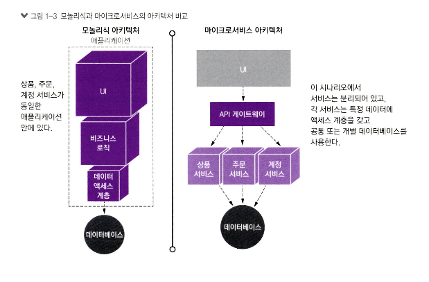
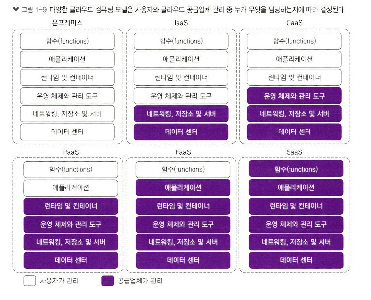
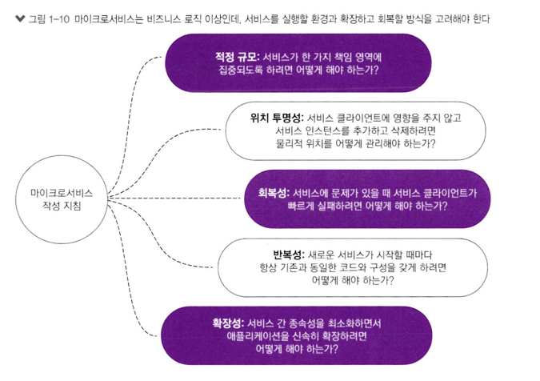
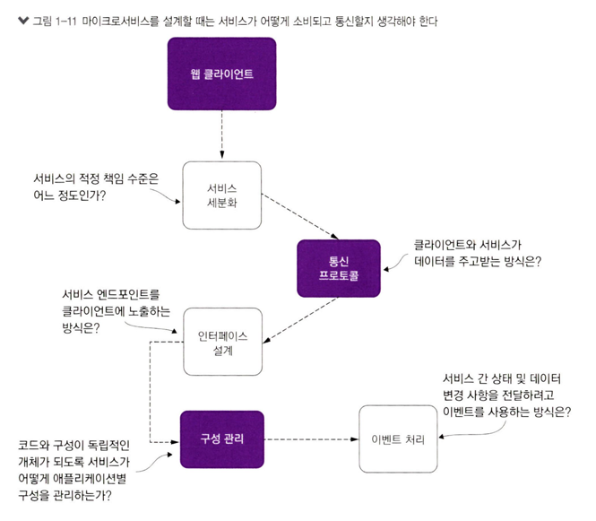

# 1. 스프링, 클라우드와 만나다

## 1.1 마이크로서비스 아키텍처로 진화
### 1.1.1 N-계층 아키텍처
- 일반적인 엔터프라이즈 아키텍처 유형 중 하나는 다계층 또는 N-계층 아키텍처이다.
  - UI, 서비스, 데이터, 테스팅 과 같은 여러 계층으로 나뉜다.
- **N-계층 애플리케이션**
  - **장점**
    - 관심사가 잘 분리되어 있어 UI, 데이터, 비즈니스 로직 영역을 따로 고려할 수 있다.
    - 팀이 여러 컴포넌트에서 독립적으로 작업하기 쉽다.
    - 숙련된 N-계층 프로젝트 개발자를 찾기가 상대적으로 수월하다.
  - **단점**
    - 변경 적용시, 전체 애플리케이션 중지 및 재시작해야 한다.
    - 메시지가 상하 전체 계층에 통행하므로 비효율적일 수 있다.
    - 대규모 N-계층 애플리케이션이 배포되고 나면 리팩터링이 어려울 수 있다.

### 1.1.2 모놀리스 아키텍처
- 모널리스 아키텍처에서 애플리케이션은 배포 가능한 **하나의 산출물로 생성**된다.
  - 모든 UI, 비지니스, 데이터베이스 로직은 고유한 애플리케이션으로 패키징 되어 서버에 배포된다.
  - [그림1-1] 모든 코드가 단일 유닛으로 빌드/테스트/배포 되기 떄문에, 여러 개발 팀은 배포일을 맞추어야 한다.  
      
- **모놀리스는 종종 훌륭한 선택지**이다.
  - N-계층, 마이크로서비스 보다 구축 및 배포가 더 쉽다.
  - 변경 가능성이 낮다면 모놀리스로 시작하는 것이 좋다.
- 애플리케이션 크기와 복잡성이 증가하기 시작하면 모놀리스를 관리하는 것은 어렵다.
- 모놀리스에 대한 모든 변경이 애플리케이션의 다른 부분까지 차례로 영향을 줄수 있다. 
### 1.1.3 마이크로서비스란?
- `마이크로서비스`는 작고 느슨하게 결합된 **분산 서비스**다.
- `마이크로서비스`를 사용하면 대규모 애플리케이션을 **책임이 명확하고 관리하기 쉬운 구성 요소로 분해**할 수 있다.
  - 잘 정의된 작은 조각으로 분해해서 **대규모 코드베이스에서 발생하는 전통적인 복잡성 문제를 해결**하도록 도울 수 있다.
- `마이크로서비스`를 고려할 때 이해해야 할 핵심 개념은 `분해(decomposing)`와 `분리(unbundling)`다.
  - 애플리케이션의 기능은 **완전히 상호 독립적**이어야 한다.
- [그림1-2] CRM 애플리케이션을 완전히 **상호 독립적인 마이크로서비스로 분해** 
  - 상호 독립적으로 빌드, 배포, 테스트할 수 있다.  
    
- [그림1-3] 모놀리식과 마이크로서비스의 아키텍처 비교  
    

> **마이크로서비스 아키텍처의 특징**
> - 애플리케이션 로직은 명확하고 대등한 **책임 경계**가 있는 **작은 컴포넌트로 분해**된다.
> - 각 요소는 작은 책임 영역을 담당하고 **서로 독립적으로 배포**된다.
> - 마이크로서비스는 서비스 소비자와 공급자 간 데이터를 교환하고자 HTTP와 JSON같은 **경량의 통신 프로토콜을 사용**한다.
> - 마이크로서비스 애플리케이션은 **기술 중립적 포맷을 사용**해서 사용하기 때문에 **서비스 하부의 기술 구현과 무관**하다.
> - 작고 독립적이고 분산적인 마이크로서비스 특성 덕분에 명확한 책임 영역을 부여할 수 있다.

### 1.1.4 애플리케이션 구축 방법을 왜 바꾸어야 할까?
1. 복잡성이 증가했다.
  > 다른 애플리케이션과 통합되지 않는 단절된 애플리케이션은 더 이상 표준이 아니다.
2. 고객은 더 빠른 전달을 원한다.
  > 소프트웨어 제품 기능을 분리해서 최대한 빠르게 릴리스되길 기대한다.
3. 고객 또한 안정적인 성능과 확장성을 요구한다.
  > 애플리케이션은 트랜잭션양에 따라 서버를 신속하고 확장하고 축소해야 한다.
4. 고객은 애플리케이션을 언제든 사용할 수 있길 기대한다.
  > 애플리케이션은 회복성이 높아야한다. 애플리케이션 한 부분의 고장이나 문제가 전체 애플리케이션으로 확대되지 않아야 한다.

- 이러한 이유로 인해 `확장성`과 `회복성`이 높은 애플리케이션을 구축하기 위해 **독립적 빌드&배포**를 할수 있어야한다. 
- 애플리케이션을 더 작은 서비스로 분리(unbundle)하고 단일 모놀리식에서 **서비스 산출물을 추출**하면 다음과 같은 시스템을 구축할 수 있다.
  - `유연성`
    - 분리된 서비스는 **새로운 기능을 신속하게 제공**하도록 구성하고 재배치 가능하다.
    - 함께 작동하는 코드가 적을수록 코드 변경에 따른 복잡성도 낮아지고 **테스트 및 배포 시간도 줄어**든다.
  - `회복성`
    - **고장은 애플리케이션 일부분에 국한**되어 애플리케이션의 **전체 장애로 확대되기 전에 억제**된다.
  - `확장성`
    - 분리된 서비스는 여러 서버에 쉽게 **수평 분산 가능**하다. 
    - 작은 서비스를 사용하면 국지적으로 **확장 가능**하고 **비용 효율**이 높다. 

- `마이크로서비스`방식이 **시스템과 조직에 혜택**을 가져다준다.
  - 콘웨이의 법칙
    > 조직의 커뮤니케이션 구조가 시스템 설계에 영향을 미친다.
  - 역콘웨이의 법칙
    > 조직의 커뮤니케이션 구조를 **원하는 시스템 아키텍처에 맞게 재구성**해야 한다. => 느슨한 결합, 자율적인팀


## 1.2 스프링 마이크로서비스
- 스프링은 자바 기반 애플리케이션을 구축할 수 있는 가장 대중적인 개발 프레임워크
- 모놀리스 애플리케이션 => 클라우드에 작은 서비스를 배포하는 분산된 모델로 이동
  - `스프링 부트` & `스프링 클라우드` 프로젝트가 시작되었다.
- `스프링 부트`
  - 핵심 제품 기능
    - **내장형 웹 서버** : tomcat(기본), jetty, Undertow
    - 프로젝트 스타터 라이브러리들
    - 스프링에 대한 기능적으로 자동화된 구성
    - 운영 환경에 바로 사용 가능한 다양한 기능
  - 이점
    - 개발 시간 단축, 효율성 생산성 향상
    - 내장형 HTTP 서버 제공
    - 보일러플레이트 코드 작성 회피
    - 스프링 데이터/시큐리티/클라우드 같은 스프링 생태계와 통합 용이
    - 다양한 개발 플러그인
- `스프링 클라우드`
  - 사설(private) 또는 공용(public) 클라우드에 마이크로서비스를 간단하게 운영하고 배포 할 수 있다.
## 1.3 우리가 구축할 것은 무엇인가?
- [그림 1-4] 이 책에서 사용될 서비스와 기술 개요  
    
  - 클라우인터 요청 시작시 액세스 토큰을 획득하기 위해 `키클록`인증을 받는다.
  - 토큰을 얻고 클라이언트는 `스프링 클라우드 API 게이트웨이`에 요청을 보낸다.
    - API 게이트웨이 서비스는 전체 아키텍처에 대한 **진입점**이다.
    - **유레카 서비스와 통신**하여 `조직` 및 `라이선스` 서비스의 위치를 조회하고 호출한다.
  - `조직 서비스`가 요청을 받으면 **키클록에 액세스 토큰의 유효성을 검증**하여 요청을 처리할 수 있는지 확인한다.
    - 조직 DB 정보 갱신, HTTP 응답을 보낸다.
    - 카프카 토픽을 전송하여 `라이선싱 서비스`가 변경 사항을 인식하게 한다. 
    - `메시지`가 `라이선싱 서비스`에 도착시, 인메모리에 저장한다.
    - **집킨**, **엘라스틱서치**, **로그 스태시**를 사용하여 `로그를 관리 및 표시`
    - **스프링 부트 액추에이터**, **프로메테우스**, **그라파나**를 통해 애플리케이션 지표를 `노출 및 표시`
## 1.4 이 책의 내용
### 1.4.1 이 책에서 배울 내용
- 마이크로서비스의 정의, 모범 사례, 설계 고려 사항
- 마이크로서비스 기반 애플리케이션을 구축하면 안 되는 경우
- 스프링 부트 프레임워크를 사용하여 MSA를 구축하는 방법
- 클라우드 기반 애플리메이션 핵심 운영 패턴
- 도커의 정의, 마이크로서비스와의 통합
- 스프링 클라우드 사용법
- 애플리케이션 지표 및 모니터링 도구로 시각화
- 집킨과 슬루스를 통한 분산 추적
- ELK 스택으로 애플리케이션 로그 관리
- 클라우드에서 서비스 배포 파이프라인 구축
### 1.4.2 이 책의 연관성

## 1.5 클라우드 및 마이크로서비스 기반 애플리케이션
### 1.5.1 스프링 부트로 마이크로서비스 구축하기
- [그림 1-5] 스프링 부트는 공통의 REST 마이크로서비스 작업

````java
@SpringBootApplication
@RestController
@RequestMapping(value="hello")
public class Application {

	public static void main(String[] args) {
		SpringApplication.run(Application.class, args);
	}

	@GetMapping(value="/{firstName}")
	public String helloGET( 
			@PathVariable("firstName") String firstName,
			@RequestParam("lastName") String lastName) {
		return String.format("{\"message\":\"Hello %s %s\"}",firstName, lastName);
	}
	
	@PostMapping
	public String helloPOST( @RequestBody HelloRequest request) {
		return String.format("{\"message\":\"Hello %s %s\"}",request.getFirstName(), request.getLastName());
	}
}

class HelloRequest{
	
	private String firstName;
	private String lastName;
	
	public String getFirstName() {
		return firstName;
	}
	public void setFirstName(String firstName) {
		this.firstName = firstName;
	}
	public String getLastName() {
		return lastName;
	}
	public void setLastName(String lastName) {
		this.lastName = lastName;
	}
}
````
### 1.5.2 클라우드 컴퓨팅이란 정확히 무엇인가?
- 클라우드 컴퓨팅
  - `유연`하고 `안전`하며 `사용하기 쉬운 환경을 제공`하고자 인터넷을 통해 **컴퓨팅과 가상화된 IT서비스(네트워킹, 소프트웨어...)를 제공**하는 것
  - 낮은 초기 투자, 사용 및 유지 보수 용이성, 확장성의 이점을 제공한다.
- [그림 1-9] 클라우드 컴퓨팅 모델  
  
- `IaaS`(Infrastructure as a Service)
  - 공급업체는 서버, 스토리지, 네트워크 같은 컴퓨팅 자원에 접근하는 **인프라스트럭처를 제공**
  - AWS EC2, Azure Virtual Machines, Google ComputeEngine, Kubernetes
- `CaaS`(Container as a Service)
  - IaaS와 PaaS의 중간모델, **컨테이너 기반 가상화의 형태**이다.
  - GKE(Google Container Engine), ECS(Elastic Container Service) 
- `PaaS`(Platform as a Service)
  - 사용자가 애플리케이션 개발, 실행, 유지관리에 집중할 수 있는 플랫폼 및 환경을 제공한다.
  - 애플리케이션을 **공급업체가 제공한 도구를 사용해서 생성**할 수 있다.
  - Google App Engine, Cloud Foundry, 헤로쿠, AWS Elastic Beanstalk
- `FaaS`(Function as a Service)
  - 서버리스 아키텍처, **확장 및 프로비저닝** 및 서버 관리 불필요.
  - **개발에만 집중**할 수 있다.
  - aws lambda, google cloud function, azure function
- `SaaS`(Software as a Service)
  - 주문형 소프트웨어, 사용자는 특정 애플리케이션을 배포하거나 **유지 관리할 필요 없다.**
  - Salesforce, SAP, google Business

### 1.5.3 왜 클라우드와 마이크로서비스인가?
- `마이크로서비스 아키텍처 핵심 개념` 중 하나는 각 서비스가 분리되어 **독립적인 산출물로 패키징 및 배포**되는 것이다.
- 마이크로서비스를 작성시 어떤 형태로 배포할지 결정해야한다.
  - 물리서버
    - 마이크로서비스를 물리서버에 배포하는 조직은 많지 않다.
    - 수평적으로 마이크로서비스를 확장하는 데 막대한 비용이 소요 될 수 있다.
  - 가상 머신 이미지
    - 마이크로서비스의 주요 이점 중 하나는 `확장성`이다.
    - 서비스 실패 이벤트에 대한 응답으로 `인스턴스를 빠르게 시작 및 종료`할 수 있다.
  - 가상 컨테이너
    - 서비스를 전체 VM에 배포하는 대신 도커 컨테이너로 클라우드에 배포한다.
    - 다수 인스턴스를 IaaS 사설 및 공용 클라우드에 신속히 배포하고 시작할 수 있다.

- `클라우드 기반 마이크로서비스`의 장점은 **탄력성** 개념에 기반을 둔다.
  - 몇분 안에 VM과 컨테이너를 가동할 수 있게 해 준다.
  - 클라우드 공급자를 통해 마이크로서비스를 배포하면 **높은 수평 확장성**을 얻을 수 있다.
  - 서버 탄력성은 **애플리케이션이 더 회복적**일 수 있음을 의미한다.
- **CaaS 클라우드 공급자의 일반적인 특징**
  - 간소화된 인프라스트럭처 관리
    - CaaS 클라우드 공급자는 **서비스에 대한 더 많은 통제 기능을 제공**한다. => 간단한 API호출로 새로운 서비스 시작&중지
  - 대규모 수평 확장성
    - 빠르고 간결하게 인스턴스를 시작할 수 있다.
  - 지리적 분산을 이용한 높은 중복성(redundancy, 다중화 /고가용성)
    - CaaS 공급자는 여러 데이터 센터를 보유한다.
    - 특정 지역에서 문제가 발생해도 다른 지역에서 동일한 서비스가 지속적으로 제공

> **PaaS 기반 마이크로서비스를 사용하지 않는 이유**  
> - 각 클라우드 제공업체 플랫폼에는그들의 PaaS 솔루션과 관련된 고유한 특성있기 때문이다.

## 1.6 마이크로서비스는 코드 작성 이상을 의미한다.
- [그림 1-10] 마이크로서비스를 작성하고 구축할 때 고려해야 할 몇 가지 지침
      

[견고한 마이크로서비스 작성 고려사항]
- `적정규모`
  - 마이크로서비스가 너무 많은 책임을 지지 않도록 적절한 크기를 유지해야한다.
- `위치 투명성`
  - 서비스 호출에 대한 **물리적 상세 정보를 관리하는 방법**이다.
  - ex) 서비스 디스커버리를 통해, 클라이언트는 호출할 서비스의 IP 주소나 포트를 알지 못하더라도 서비스의 이름으로 접근
- `회복성`
  - 실패한 서비스를 우회하고 빠른 실패 방식을 적용하여 **마이크로서비스 소비자와 애플리케이션의 무결성을 보호**하는 방법이다.
- `반복성`
  - 모든 새 인스턴스가 시작할 때 다른 서비스와 **동일한 구성과 코드베이스를 보장하는 방법**이다.
- `확장성`
  - 종속 관계를 최소화하고 **마이크로서비스를 적절히 확장할 수 있도록 구축하는 방법**이다.
## 1.7 핵심 마이크로서비스 개발 패턴
- [그림 1-11] 마이크로서비스 구축에 대한 기본 사항
  
- `서비스 세분성`
  - 서비스를 서로 다른 비지니스 도메인이 중첩될 정도로 크게 나누면 유지 관리하고 변경하기 어렵다.
  - 서비스를 너무 세분화하면 애플리케이션의 복잡성이 전반적으로 높아진다.
  - 3장
- `통신 프로토콜`
  - 동기와 비동기 프로토콜 중 어떤 것이 필요한지 정해야 한다.
    - 동기 프로토콜
      - XML, JSON, Thrift 와 같은 HTTP 기반 REST 통신
    - 비동기 프로토콜
      - RabbitMQ, 아파치 카프카, 아마존 SQS 같은 메시지 브로커
- `인터페이스 설계`
  - 인터페이스를 설계하는 가장 좋은 방법은 어떤 것일까?
  - 서비스를 어떻게 구조화할 것인가?
- `서비스 구성 관리`
  - 서로 다른 환경 간 마이크로서비스의 구성을 호환하려면 어떻게 구성을 관리해야 하는가?
  - 5장
- `서비스 간 이벤트 처리`
  - 서비스 간 의존성을 최소화하고 애플리케이션 탄력성을 높이고자 이벤트를 사용하여 분리하는 방법은 무엇인가?
  - 10장

## 1.8 마이크로서비스 라우팅 패턴
## 1.9 마이크로서비스 클라이언트 회복성
## 1.10 마이크로서비스 보안 패턴
## 1.11 마이크로서비스 로깅과 추적 패턴
## 1.12 애플리케이션 지표 패턴
## 1.13 마이크로서비스 빌드/배포 패턴
## 1.14 요약
