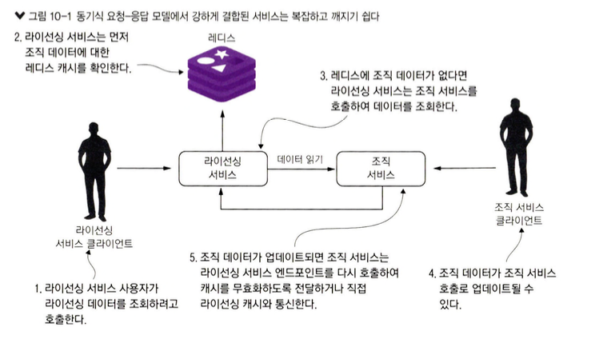
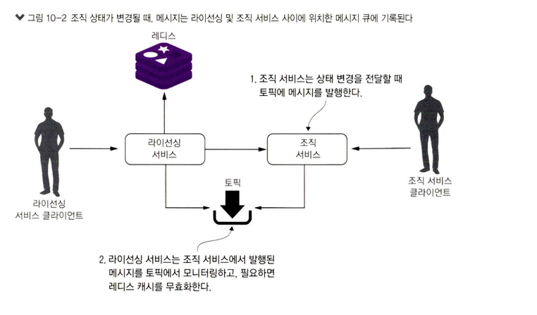
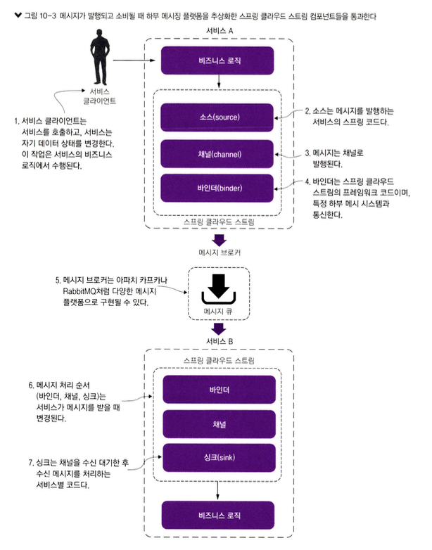
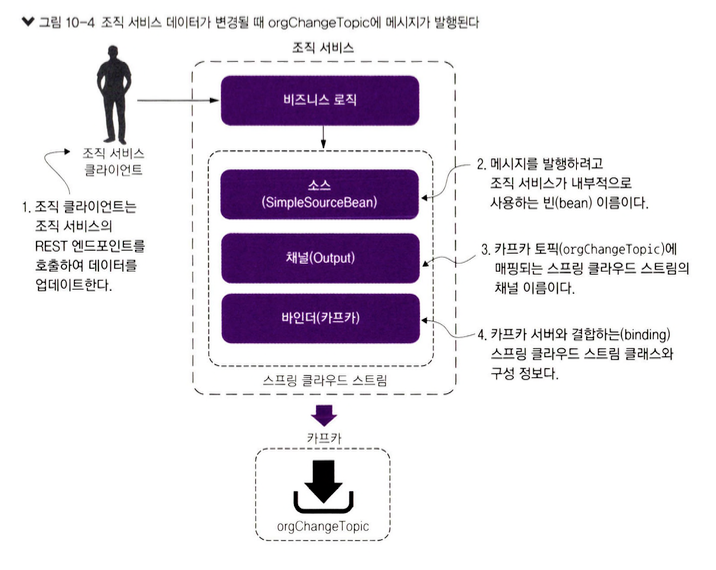
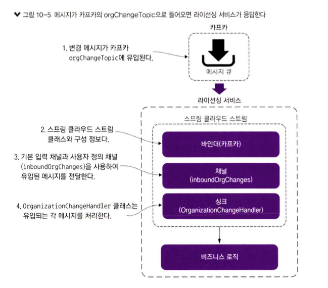
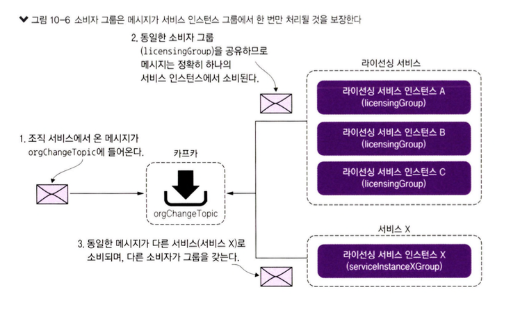
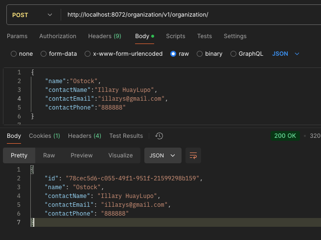
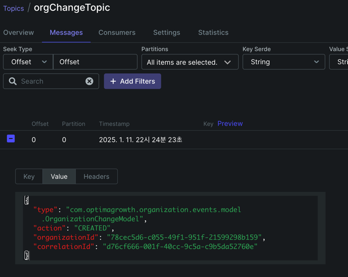
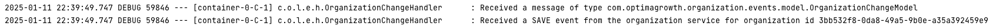

# 10. 스프링 클라우드 스트림을 사용한 이벤트 기반 아키텍처

## 10.1 메시징과 EDA, 마이크로서비스의 사례
### 10.1.1 동기식 요청-응답 방식으로 상태 변화 전달
               
출처 : 길벗 - 스프링 마이크로서비스 코딩 공작소 개정2판  

**[서비스 간 강한 결합]**    
- 데이터를 조회하려고 `라이선싱 서비스`는 **조직 서비스에 의존**
- 조직 레코드가 업데이트시, `조직 서비스`가 **라이선싱 서비스 의존**

**[쉽게 깨지는 서비스 관계]**  
- 라이선싱 서비스가 다운되거나 느려지면 조직 서비스는 영향을 받는다.

**[조직 서비스의 변경에 관심 있는 새 서비스를 추가할 때의 경직성]**  
- 조직 데이터 변경에 관심이 있는 다른 서비스가 생겼다면 조직 서비스에서 그 서비스로 호출을 추가해야 한다.
- 상태 변경을 전달하려고 동기식 요청-응답 모델을 사용하면, 애플리케이션의 핵심 서비스와 다른 서비스 간에 `거미줄 같은 종속적 형태`가 된다.

> **또 다른 종류의 결합**
> - JSON 메시지 구조를 변경할 때 두 서비스가 동일한 메시지 타입에 대한 여러 버전을 적절히 처리하지 못한다면 자바로 상호 변환할 때 문제
>   - `버전 관리 기능이` 내장된 바이너리 프로토콜인 아파치 아브로

### 10.1.2 메시징을 사용한 서비스 간 상태 변화 전달
               
출처 : 길벗 - 스프링 마이크로서비스 코딩 공작소 개정2판  
- 조직 데이터가 변경될 때 조직 서비스는 메시지를 토픽에 발행
- 상태 전달에서 `메시지 큐(토픽)`는 라이선싱 서비스와 조직 서비스 사이의 **중개자 역할**

**[느슨한 결합]**  
- 서비스가 소유한 데이터를 직접 관리하는 엔드포인트만 노출해서 **종속성을 최소화**
- 라이선싱 서비스는 메시지가 수신되었다는 것만 알고 **누가 발행했는지는 알지 못한다**

**[내구성]**  
- 큐가 있으면 서비스 소비자가 다운된 경우에도 **메시지 전달을 보장**

**[확장성]**  
- 큐에서 메시지를 읽어 오는 소비자가 메시지를 빠르게 처리하지 못한다면, 메시지 소비자를 더 많이 가동

**[유연성]**  
- **메시지 발신자**는 `누가 메시지를 소비`할지 **모른다**. 
- 원본 발송 서비스에 영향을 주지 않은 채 **새로운 메시지 소비자를 쉽게 추가**할 수 있음

### 10.1.3 메시징 아키텍처의 단점
- 메시지 기반 아키텍처는 복잡하다.

**[메시지 처리의 의미론]**  
- 애플리케이션이 메시지가 소비되는 순서에 따라 어떻게 동작하는지 알아야 한다.
- 메시지가 순서대로 처리되지 않을 때 어떻게 되는지를 이해해야 한다.
**[메시지 가시성]**  
- 메시지의 비동기적 특성으로 메시지가 발행되거나 소비되는 시점에 바로 수신 또는 처리되지 않을 수 있다.
**[메시지 코레오그래피]**  
- 메시징 기반 애플리케이션을 디버깅하려면 여러 다른 서비스의 로그를 모두 살펴보아야 한다. => 추적이 어렵다.

> **Note**
> - **메시징은 복잡하지만 강력**
> - 서비스에서 메시징을 사용할 때 `사전 숙고가 필요함을 강조`

## 10.2  스프링 클라우드 스트림 소개
- `스프링 클라우드 스트림`를 사용하면 스프링 기반 마이크로서비스에 **메시징을 쉽게 통합**할 수 있다.
- 스프링 클라우드 스트림은 우리가 사용하는 메시징 플랫폼의 세부 구현도 추상화

**[메시지 발행 & 구독]**  
                 
출처 : 길벗 - 스프링 마이크로서비스 코딩 공작소 개정2판  

- 스프링 클라우드에서 메시지를 발행&소비 알아둬야할 네개의 컴포넌트
  - **소스**
    - 소스는 메시지를 받아 직렬화하고 메시지를 채널에 발행
  - **채널**
    - 메시지를 보내고 받는 큐
  - **바인더**
    - 특정 메시지 플랫폼과 통신하 는 스프링 코드
  - **싱크**
    - 들어오는 메시지 채널을 수신 대기, 메시지를 다시 객체로 역직렬화

## 10.3 간단한 메시지 생산자와 소비자 작성
[그림 10-4] 메시지 생상자, 일반적인 스프링 클라우드 스트림 아키텍처 
                 
출처 : 길벗 - 스프링 마이크로서비스 코딩 공작소 개정2판  

### 10.3.1 아파치 카프카 및 레디스 도커 구성
### 10.3.2 조직 서비스에서 메시지 생산자 작성
- 조직 데이터 추가, 수정, 삭제시 카프카 토픽에 메시지 발행
- 의존성 추가
  ````xml
    <dependency>
        <groupId>org.springframework.cloud</groupId>
        <artifactId>spring-cloud-stream</artifactId>
    </dependency>
      <dependency>
        <groupId>org.springframework.cloud</groupId>
        <artifactId>spring-cloud-starter-stream-kafka</artifactId>
    </dependency>
  ````

- 스프링 클라우드 스트림이 메시지 브로커에 대플리케이션을 바인딩하도록 지정
  ````java
  @EnableBinding(Source.class)    
  public class OrganizationServiceApplication {
    public static void main(String[] args) {
      SpringApplication.run(OrganizationServiceApplication.class, args);
    }
  }
  ````

- UserContext 변수를 ThreadLocal로 만들기
  ````java
  @Component
  public class UserContext {
    private static final ThreadLocal<String> orgId = new ThreadLocal<String>();
  }
  ````

- 메시지 브로커에 메시지 발행
  - 조직ID 삭제, 생성, 수정, 조회 
  ````java
  @Component
  public class SimpleSourceBean {
      private Source source;

      @Autowired
      public SimpleSourceBean(Source source){
          this.source = source;
      }
    
      public void publishOrganizationChange(ActionEnum action, String organizationId){
         logger.debug("Sending Kafka message {} for Organization Id: {}", action, organizationId);
         OrganizationChangeModel change =  new OrganizationChangeModel(
                  OrganizationChangeModel.class.getTypeName(),
                  action.toString(),
                  organizationId,
                  UserContext.getCorrelationId());  //자바 POJO 메시지 발행

         source.output().send(MessageBuilder.withPayload(change).build());  //Source 클래스에 정의된 채널에서 전달된 메시지 발송
      }
  }
  ````

- 프로퍼티 설정
  ````yaml
  spring.cloud.stream.bindings.output.destination=orgChangeTopic
  spring.cloud.stream.bindings.output.content-type=application/json
  spring.cloud.stream.kafka.binder.zkNodes=kafka
  spring.cloud.stream.kafka.binder.brokers=kafka
  ````

- 조직 서비스에서 메시지 발행하기
  ````java
  @Service
  public class OrganizationService {
    @Autowired
    SimpleSourceBean simpleSourceBean;
  
    //조직 생성시
    public Organization create(Organization organization){
    	organization.setId( UUID.randomUUID().toString());
        organization = repository.save(organization);
        simpleSourceBean.publishOrganizationChange(ActionEnum.CREATED, organization.getId());
        return organization;

    }
  }
  ````

> 어떤 데이터를 메시지에 넣어야 할까?
> - 필자 -> **애플리케이션 마다 다르다**
> - 메시지 안에 상태를 전달하려는 경우, 소비자 서비스가 전달된 데이터를 검사하고 이미 가진 데이터 복사본보다 이전것인지 판단할 수 있도록 **날짜-시간 스탬프** 또는 **버전번호**를 포함해야 한다.

### 10.3.3 라이선싱 서비스에서 메시지 소비자 작성
                 
출처 : 길벗 - 스프링 마이크로서비스 코딩 공작소 개정2판  

- 메시지 소비
  ````java
  @EnableBinding(Sink.class)
  public class LicenseServiceApplication {
  
    @StreamListener(Sink.INPUT) //채널에서 메시지를 받을 때마다 이 메서드를 실행
	public void loggerSink(OrganizationChangeModel orgChange) {
		logger.debug("Received {} event for the organization id {}", orgChange.getAction(), orgChange.getOrganizationId());
	}
  }
  ````

- 라이센싱 서비스 카프카 메시지 토픽 매핑
  ````yaml
  spring.cloud.stream.bindings.inboundOrgChanges.destination= orgChangeTopic
  spring.cloud.stream.bindings.inboundOrgChanges.content-type= application/json
  spring.cloud.stream.bindings.inboundOrgChanges.group= licensingGroup
  spring.cloud.stream.kafka.binder.zkNodes= kafka
  spring.cloud.stream.kafka.binder.brokers=kafka
  ````

- [그림 10-6] 소비자 그룹은 메시지가 서비스 인스턴스 그룹 에서만 처리되는 것을 보장
                 
출처 : 길벗 - 스프링 마이크로서비스 코딩 공작소 개정2판  

### 10.3.4 메시지 서비스동작 보기
                 
  
  

## 10.4 스프링 클라우드 스트림 사용 사례: 분산 캐싱
- 분산 캐싱 구축 실습
  - 라이선싱 서비스는 조직서비스 데이터를 레디스 캐시에서 확인
  - 캐시에 없으면 조직 서비스를 호출 & 결과를 레디스에 저장

> 클라우드 캐싱과 메시징
> - 레디스를 사용하면 다음 장점
>   - 데이터 검색 성능을 향상
>   - 데이터를 보유한 데이터베이스 테이블에 대한 부하&비용 줄임

### 10.4.1 캐시검색을위한레디스
[스프링 데이터 레디스 의존성으로 라이선싱 서비스 구성]
````xml
<dependency>
    <groupId>org.springframework.data</groupId>
    <artifactId>spring-data-redis</artifactId>
</dependency>
<dependency>
    <groupId>redis.clients</groupId>
    <artifactId>jedis</artifactId>
    <type>jar</type>
</dependency>
````
[레디스 서버에 대한 데이터베이스 커넥션 설정]
````java
public class LicenseServiceApplication {
  @Bean
  JedisConnectionFactory jedisConnectionFactory() {
    String hostname = serviceConfig.getRedisServer();
    int port = Integer.parseInt(serviceConfig.getRedisPort());
    RedisStandaloneConfiguration redisStandaloneConfiguration = new RedisStandaloneConfiguration(hostname, port);
    //redisStandaloneConfiguration.setPassword(RedisPassword.of("yourRedisPasswordIfAny"));
    return new JedisConnectionFactory(redisStandaloneConfiguration);
  }

  @Bean
  public RedisTemplate<String, Object> redisTemplate() {
    RedisTemplate<String, Object> template = new RedisTemplate<>();
    template.setConnectionFactory(jedisConnectionFactory());
    return template;
  }
}
````
````yaml
redis.server = redis
redis.port = 6379
````
[스프링 데이터 레디스 저장소 정의]
- 레디스는 크고 분산된 인메모리 해시맵과 같은 역할을 하는 **키-값 데이터 저장소**
````java
@Repository
public interface OrganizationRedisRepository extends CrudRepository<Organization,String>  {
}

@RedisHash("organization")
public class Organization extends RepresentationModel<Organization> {
    
}
````

[레디스와 라이선싱 서비스로 조직 데이터 저장 및 읽기]
````java
@Component
public class OrganizationRestTemplateClient {
    
  @Autowired
  OrganizationRedisRepository redisRepository;
   
  //조회
  private Organization checkRedisCache(String organizationId) {
    try {
      return redisRepository.findById(organizationId).orElse(null);
    }catch (Exception ex){
      logger.error("Error encountered while trying to retrieve organization {} check Redis Cache.  Exception {}", organizationId, ex);
      return null;
    }
  }
  //저장
  private void cacheOrganizationObject(Organization organization) {
    try {
      redisRepository.save(organization);
    }catch (Exception ex){
      logger.error("Unable to cache organization {} in Redis. Exception {}", organization.getId(), ex);
    }
  }
}
````
> **Note** 
> - 캐시와 통신할 때는 예외 처리에 세심한 주의를 기울여야 한다.
> - 레디스와 통신 불가시, 예외를 기록하고 조직 서비스를 호출해야한다.
> - **캐싱은 성능을 향상시키는것이 목적**이다.

### 10.4.2 사용자 정의 채널 설정


## 10.5 요약

               
출처 : 길벗 - 스프링 마이크로서비스 코딩 공작소 개정2판  