# 11. 스프링 클라우드 슬루스와 집킨을 이용한 분산 추적
- **마이크로서비스 아키텍처**는 복잡한 모놀리식 소프트웨어 시스템을 `더 작고 관리 가능한 부분으로 분해`하는 설계 패러다임
  - 분해된 부분들은 서로 **독립적**으로 `빌드`되고 `배포`
  - 하지만, 이러한 유연성에는 **복잡함**이라는 비용
  - `디버깅`하는 것은 매우 번거롭고 **어려움**
    - 여러 서비스와 물리 머신, 다양한 데이터 저장소
- 분산 디버깅을 위한 몇 가지 기술과 기법
  - **상관관계ID를 사용**하여 `여러 서비스간 트랜잭션 연결`
  - 다양한 서비스에서 전송된 **로그 데이터**를 검색 가능한 `단일 소스로 수집`
  - 여러 서비스 간 `사용자 트랜잭션 흐름을 시각화`
  - ELK 스택을 이용한 실시간 로그 데이터 분석, 검색, 시각화
- 기술 사용
  - `스프링 클라우드 슬루스`
    - 유입되는 HTTP 요청을 상관관계ID를 측정
  - `집킨`
    - 트랜잭션 흐름을 보여주는 오픈소스 데이터 시각화 도구
  - `ELK 스택`
    - 실시간으로 로그를 분석, 검색, 시각화
  
## 11.1 스프링 클라우드 슬루스와 상관관계 ID
- **상관관계 ID** 
  - 트랜잭션 시작시 할당
  - 임의로 생성된 고유 번호나 문자열
  - 상관관계 ID는 서비스 간 호출로 전파

- 라이선싱&조직 서비스에 스프링 클라우드 슬루스 추가
  - 상관관계 ID가 존재하지 않는다면 상관관계 ID를 생성해서 서비스 호출에 삽입
  - 아웃바운드 서비스 호출에 대한 상관관계 ID 전파를 관리하여 트랜잭션에 대한 상관관계 ID가 자동으로 추가
  - **상관관계 정보를 스프링 MDC 로깅에 추가**하면 생성된 상관관계 ID가 `스프링 부트의 기본 SL4J와 로그백 구현체에 자동으로 로깅`
  - 서비스 호출의 추적 정보를 **집킨 분산 추적 플랫폼에 발행**

> **Note**
> - 스프링 클라우드 슬루스로 스프링 부트 `로깅 구현체를 사용`하면 마이크로서비스의 **로그에 상관관계 ID가 자동으로 추가**된다.

### 11.1 라이선싱 및 조직 서비스에 스프링 클라우드 슬루스 추가
- `조직`, `라이선싱`, `게이트웨이` 추가
````xml
<dependency> 
    <groupId> org.springframework.cloud </groupId> 
    <artifactId>spring-cloud-starter-sleuth</artifactId> 
</dependency>
````
- 스프링 클라우드 슬루스 추적 정보를 스프링 MDC에 추가하여 마이크로서비스에서 **생성된 모든 로그 문이 로깅**
- 스프링 클라우드의 추적 정보를 서비스가 생성한 모든 아웃바운드 HTTP 호출과 **스프링 메시징 채널의 메시지에 삽입**

## 11.2 스프링 클라우드 슬루스의 추적 분석
[그림 11-3] 서비스 통합 로깅  
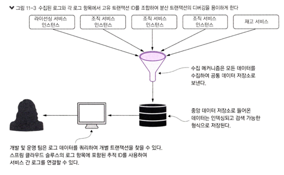                 
출처 : 길벗 - 스프링 마이크로서비스 코딩 공작소 개정2판
- 다양한 통합 로깅 솔루션  
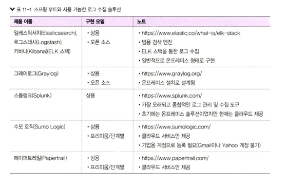                   
출처 : 길벗 - 스프링 마이크로서비스 코딩 공작소 개정2판  

### 11.2.1 동작하는 스프링 클라우드 슬루스/ELK 스택 구현
- ELK 설정
  - 로그백 구성
  - 도커 컨테이너 ELK 정의 & 실행
  - 키바나 구성
  - 상관관계 ID 기반으로 쿼리를 실행하여 구현을 테스트

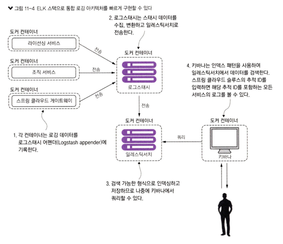                    
출처 : 길벗 - 스프링 마이크로서비스 코딩 공작소 개정2판  

### 11.2.2 서비스에서 로그백 구성
[로그스태시 인코더 추가]
- `조직`, `라이선싱`, `게이트웨이` 추가
````xml
<dependency>
    <groupld>net.logstash.logback</groupld> 
    <artifactId>logstash-logback-encoder</artifactId> 
    <version>6.3</version>
</dependency>
````

[로그스태시 TCP 어펜더 생성]
- LogstashEncoder 사용
- resource 하위, loback-spring.xml 생성
- 게이트웨이, 라이선스, 조직 서비스
````xml
<?xml version="1.0" encoding="UTF-8"?>
<configuration>
    <include resource="org/springframework/boot/logging/logback/base.xml"/>
	 <springProperty scope="context" name="application_name" source="spring.application.name"/>
    <appender name="logstash" class="net.logstash.logback.appender.LogstashTcpSocketAppender">
        <destination>logstash:5000</destination>
       <encoder class="net.logstash.logback.encoder.LogstashEncoder"/>
    </appender>
    <root level="INFO">
        <appender-ref ref="logstash"/>
        <appender-ref ref="CONSOLE"/>
    </root>
    <logger name="org.springframework" level="INFO"/>
    <logger name="com.optimagrowth" level="DEBUG"/>
</configuration>
````
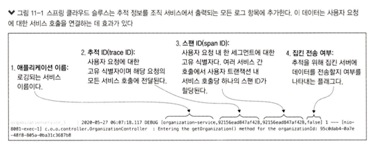                    
출처 : 길벗 - 스프링 마이크로서비스 코딩 공작소 개정2판    

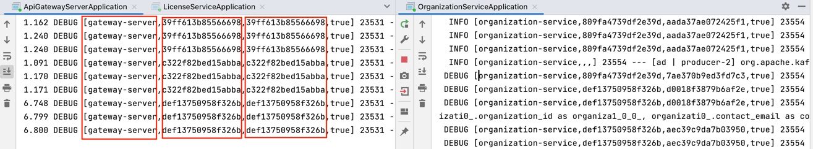                    

- **LoggingEventCompositeJsonEncoder** 를 사용하여, 새로운 로깅 패턴을 설정할 수 있다.

### 11.2.3 도커에서 ELK 스택 애플리케이션 정의 및 실행
- ELK 스택 컨테이너를 설정하
  - 첫 번째는 로그스태시 구성 파일을 생성. 
  - 두 번째는 도커 구성 안에 ELK 스택 애플리케이션을 정의
- 로그스태시 파이프라인이 두 개의 `필수 엘리먼트`
  - **input** 
    - 특정 이벤트 소스를 읽는다.
    - 깃허브, http, tcp, 카프카
  - **output** 
    - 이벤트 데이터를 특정 목적지로 보내는 역할
    - csv, 엘라스틱서치, 이메일, 파일, 몽고db, 레디스, stdout
- 로그스태시 구성의 `선택적 엘리먼트`
  - filter 플러그인
  - 변환, 새 정보추가, 날짜파싱, 필드 줄이기 등 **이벤트에 대한 중간 처리 수행**

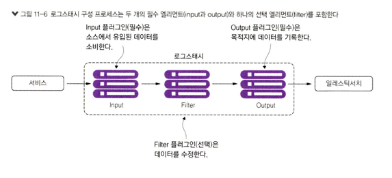                     
출처 : 길벗 - 스프링 마이크로서비스 코딩 공작소 개정2판     

- input 플러그인 => TCP 어펜더
- output 플러그인 => 엘라스틱 서치 엔진
````yaml
input {
  tcp {
    port => 5000
    codec => json_lines
  }
}

filter {
  mutate {
    add_tag => [ "manningPublications" ]
  }
}

output {
  elasticsearch {
    hosts => "elasticsearch:9200"
  }
}
````


### 11.2.4 키바나 구성
- **키바나**는 일련의 `인덱스 패턴을 사용하여 일레스틱서치 데이터`를 검색
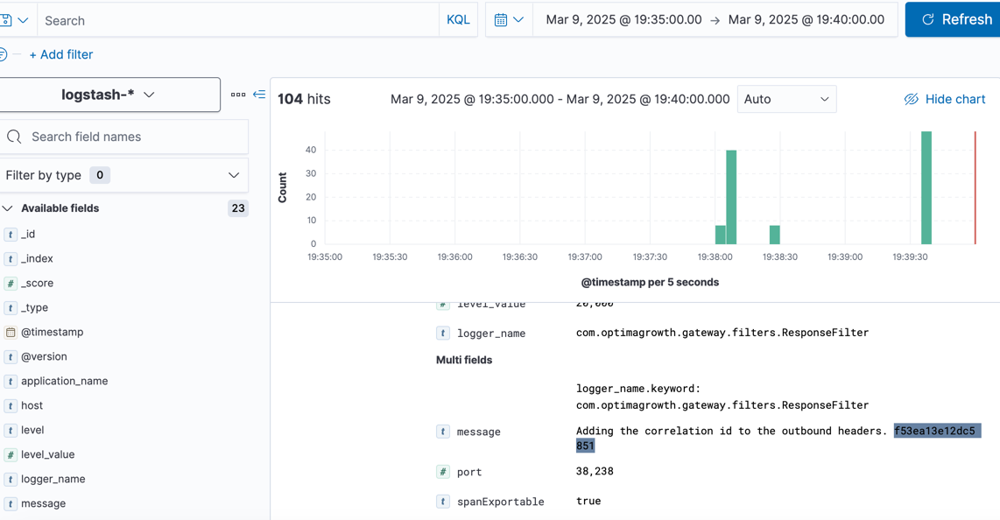    
### 11.2.5 키바나에서 스프링 클라우드 슬루스의 추적 ID 검색
````java
@Configuration
public class ResponseFilter {
 
    final Logger logger =LoggerFactory.getLogger(ResponseFilter.class);
    
    @Autowired
    Tracer tracer;
    
    @Autowired
	FilterUtils filterUtils;
 
    @Bean
    public GlobalFilter postGlobalFilter() {
        return (exchange, chain) -> {
            return chain.filter(exchange).then(Mono.fromRunnable(() -> {
            	  String traceId = tracer.currentSpan().context().traceIdString();
            	  logger.debug("Adding the correlation id to the outbound headers. {}", traceId);
                  exchange.getResponse().getHeaders().add(FilterUtils.CORRELATION_ID, traceId);
                  logger.debug("Completing outgoing request for {}.", exchange.getRequest().getURI());
              }));
        };
    }
}
````
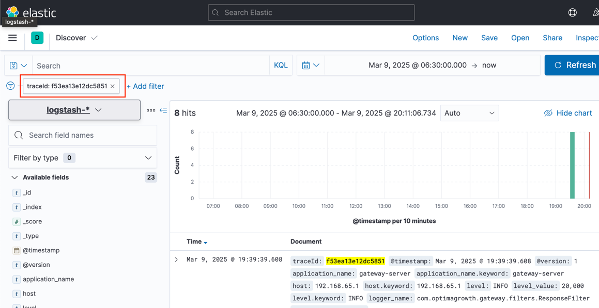      
## 11.3 집킨을 사용한 분산 추적
- **집킨**은 여러 서비스 호출 사이의 **트랜잭션을 추적할 수 있는 분산 추적 플랫폼**
  - `트랜잭션에 소요된 시간을 그래픽으로 확인`하고 호출과 관련된 각 `마이크로서비스별 소요 시간을 분석`
### 11.3.1 스프링 클라우드 슬루스와 집킨 의존성 설정
- 게이트웨이, 라잉선싱, 조직 서비스 3개에 추가
````xml
<dependency>
    <groupId>org.springframework.cloud</groupId>
    <artifactId>spring-cloud-sleuth-zipkin</artifactId>
</dependency>
````

### 11.3.2 집킨 연결을 위한 서비스 구성 설정
````properties
# 게이트웨이
spring:
  zipkin:
    baseUrl: http://localhost:9411

# 조직서비스
spring.zipkin.baseUrl:http://localhost:9411

# 라이선싱서비스
spring.zipkin.baseUrl:http://localhost:9411
````
### 11.3.3 집킨 서버 구성
- 집킨은 기본적으로 인메모리 데이터 저장소를 사용, 운영 환경에서 인메모리 데이터베이스를 사용하지 않는것이 좋음
  - 예제에서는 엘라스틱 서치로 데이터를 전송
### 11.3.4 추적 레벨 설정
- 각 서비스가 집킨에 데이터를 기록할 빈도를 정의
````properties
# 0 이면, 슬루스가 집킨에 트랜잭션을 전송하지 않음.
# 0.5이면, 50% 만 전송함

# 라이선싱 서비스
spring.sleuth.sampler.percentage: 1
# 조직 서비스
spring.sleuth.sampler.percentage: 1
````
### 11.3.5 집킨으로 트랜잭션 추적
> Note
> - 트랜잭션에 참여하는 모든 서비스와 개별 성능 시간을 이해하는 것은 **분산 아키텍처를 지원하는 데 매우 중요**

### 11.3.6 더 복잡한 트랜잭션의 시각화
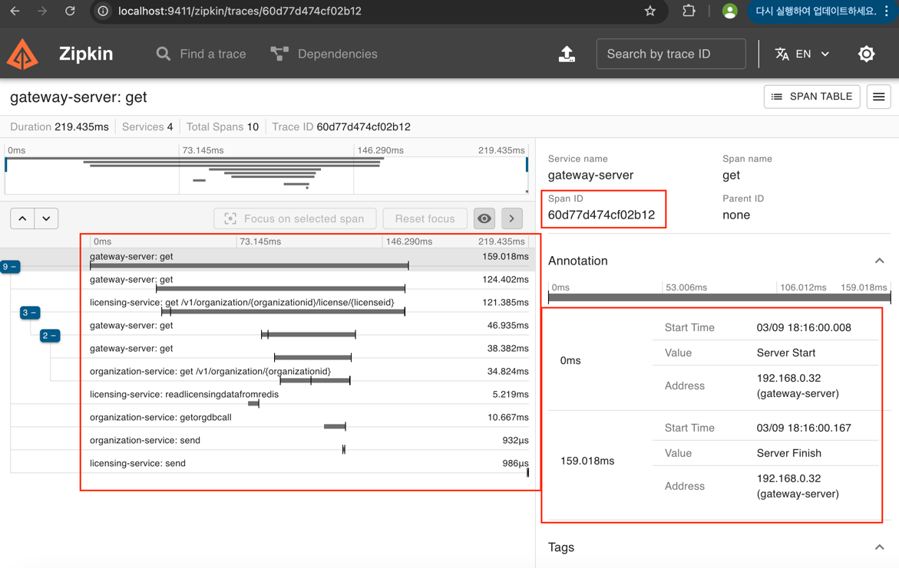                       
### 11.3.7 메세지 추적 수집
- 메시지큐 정보
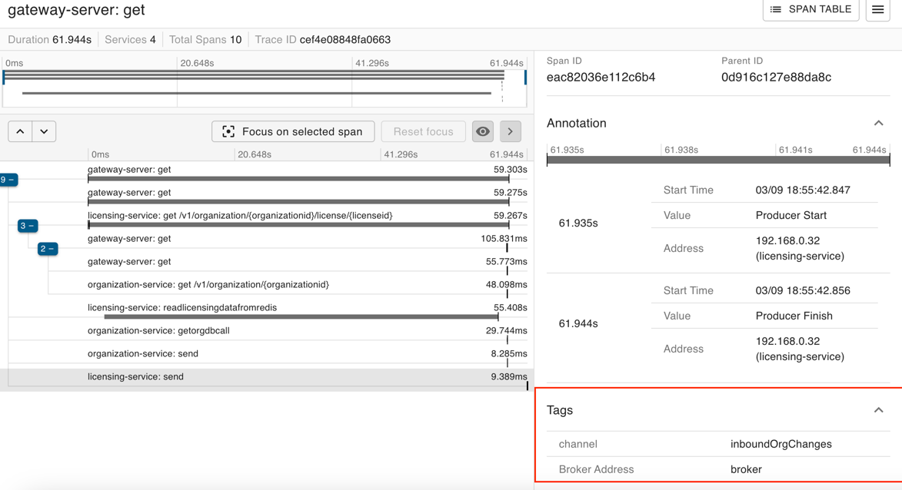  
### 11.3.8 사용자 정의 스팬
````java
// 레디스 span 아이디 추가
private Organization checkRedisCache(String organizationId) {
    ScopedSpan newSpan = tracer.startScopedSpan("readLicensingDataFromRedis"); //사용자 정의스팬 정의
    try {
        return redisRepository.findById(organizationId).orElse(null);
    }catch (Exception ex){
        logger.error("Error encountered while trying to retrieve organization {} check Redis Cache.  Exception {}", organizationId, ex);
        return null;
    }finally {
        newSpan.tag("peer.service", "redis"); //태그(tag) 집킨이 캡처할 서비스 이름을 지정
        newSpan.annotate("Client received");
        newSpan.finish();
    }
}
````
- 레디스 정보
  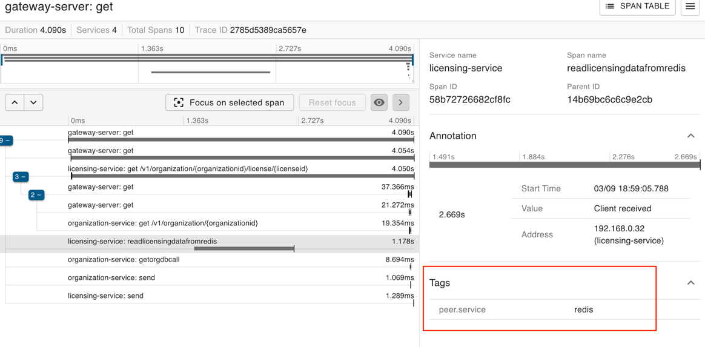  
## 11.4 요약
- 스프링 클라우드 슬루스를 사용하여 마이크로서비스 호출에 대한 **상관관계 ID를 손쉽게 추가**할 수 있다.
- **상관관계ID**는 **여러 서비스간 로그를 연결하는데 사용**