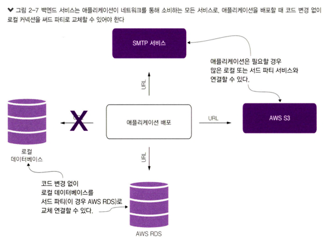
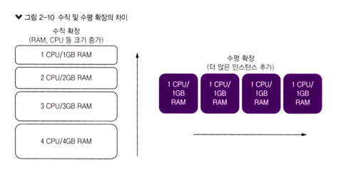
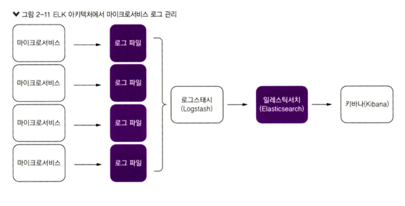

# 2. 스프링 클라우드와 함께 마이크로서비스 세계 탐험
- **시스템이 더 많이 분산될수록 실패할 곳은 더 많아진다.**
  - 마이크로서비스 아키텍처에 더 많은 실패 지점이 있다는 것을 의미한다.
## 2.1 스프링 클라우드란?
- 시장에서 검증된 수많은 오픈 소스 프로젝트를 모아 스프링 하위 프로젝트인 **스프링 클라우드**로 통합했다.
  - 프로젝트 설정 및 구성을 단순화

[그림 2-1] 마이크로서비스 개발 패턴
        
출처 : 길벗 - 스프링 마이크로서비스 코딩 공작소 개정2판    

### 2.1.1 스프링 클라우드 컨피그
- **스프링 클라우드 컨피그**는 `애플리케이션 구성 데이터를 관리`한다.
- 애플리케이션구성 데이터(특히 환경별 구성 데이터)는 배포된 **마이크로서비스에서 완전히 분리**된다.
  - **모든 마이크로서비스가 동일한 구성을 보장**
- 스프링 클라우드 컨피그는 아래와 같은 **오픈 소스 프로젝트와 통합**된다.
  - `깃` : 스프링 클라우드 컨피그는 깃 백엔드 저장소와 통합
  - `콘술` : 오픈소스 서비스 디스커버리
  - `유레카` : 넷플릭스 오픈 소스 프로젝트

### 2.1.2 스프링 클라우드 서비스 디스커버리
- `스프링 클라우드 서비스 디스커버리`를 사용하면 **서버가 배포된 물리적 위치(IP 및 서버 이름)를 추상화**한다.
- 클라이언트는 물리적 위치가 아닌 `논리적 이름을 사용하여 서버의 비즈니스 로직을 호출`
> 콘술과 주키퍼가 강력하고 유연하지만 자바 개발자 커뮤니티는 여전히 유레카를 사용한다.

### 2.1.3 스프링 클라우드 로드 밸러서와 Resilience4j
- `스프링 클라우드 로드밸런서`
  - 서비스 디스커버리 에이전트와 통합(스프링 클라우드 로드밸런서가 특정 서비스의 인스턴스를 동적으로 찾아내고 연결)
  - 클라이언트 부하 분산 기능 제공
  - 서비스 디스커버리 에이전트가 잠시 중단되더라도 시스템이 완전히 멈추지 않고, 이미 알려진 인스턴스에 대한 호출을 유지할 수 있다
- `Resilience4j 라이브러리를 사용`
  - 회로 차단기, 재시도, 벌크헤드 등 **클라이언트 회복성 패턴을 구현**
### 2.1.4 스프링 클라우드 API 게이트웨이
- `API 게이트웨이`는 **서비스 라우팅 기능을 제공**한다.
  - 모든 호출이 `현관`을 통과하도록 하는 서비스 게이트웨이
  - `보안 인가`, `인증`, `콘텐츠 필터링`과 `라우팅 규칙` 등 **표준 서비스 정책을 시행**

### 2.1.5 스프링 클라우드 스트림
- `스프링 클라우드 스트림`은 **메시지 처리 기능을 마이크로서비스에 통합**하는 기술
  - RabbitMQ, 카프카와 같은 메시지 브로커를 서비스와 통합

### 2.1.6 스프링 클라우드 슬루스
- `스프링 클라우드 슬루스`는 **고유한 추적 식별자**를 애플리케이션에서 사용되는 HTTP 호출 및 메시지(카프카,엠큐) 채널에 통합한다.
  - 상관관계 ID나 트레이스 ID 를 사용하여 트랜잭션을 추적
  - 트레이스 ID: 요청 흐름 전체를 추적하는 식별자(상위 개념)
  - 상관관계 ID: 하위 요청 간의 상관관계를 추적하는 식별자(하위 개념)

### 2.1.7 스프링 클라우드 시큐리티
- `스프링 클라우드 시큐리티` **인증 및 인가(권한 부여) 프레임워크**
  - 서비스는 인증 시스템에서 발급된 토큰을 사용하여 서로 통신
  - HTTP 호출을 받는 각 서비스는 **전달받은 토큰을 확인**하여 사용자의 신원과 액세스 권한을 검증

## 2.2 스프링 클라우드 예제 소개
- 스프링 클라우드는 몇 가지 간단한 애너테이션과 구성 정보만으로 검증된 마이크로서비스 기능을 활용

## 2.3 클라우드 네이티브 마이크로서비스 구축 방법
- `클라우드 레디` 애플리케이션
  - 현장에 구축된 서버에서 사용되는 애플리케이션
  - 클라우드 시대 도래하여, 정적환경 => 동적 환경으로 변화 
  - 클라우드 레디 애플리케이션은 클라우드에서 작동하기 위해 어떤 변경이나 변환이 필요하지 않다
- `클라우드 네이티브` 애플리케이션
  - 클라우드 컴퓨팅 아키텍처의 모든 이점과 서비스를 활용할 수 있도록 특별히 설계 
          
  출처 : 길벗 - 스프링 마이크로서비스 코딩 공작소 개정2판  

> **클라우드 네이티브 개발을 위한 네 가지 원칙**
> - 데브옵스 개발+운영의 약어, 개발자와 IT 운영 간 협업 통합을 중심에 둔 개발 방법론
>   - 데브옵스의 주요목표는 소프트웨어 전달 프로세스 및 인프라 변경을 저렴한 비용으로 자동화하는것.
> - 마이크로서비스는 작고, 느슨하게 결합된 분산 서비스다.
> - 지속적 전달은 소프트웨어 개발 관행이다.
> - 컨테이너는 가상 머신 이미지에 마이크로서비스를 배포하는 자연스러운 확잦ㅇ이다.

- `헤로쿠`에서 말하는 **마이크로서비스를 만드는 모범 사례 지침**(12 팩터 앱)
        
출처 : 길벗 - 스프링 마이크로서비스 코딩 공작소 개정2판  

### 2.3.1 코드베이스
- 각 마이크로서비스는 **단일 코드베이스**를 가진다.
  - `서버 프로비저닝 정보를 버전 관리`한다.
        
출처 : 길벗 - 스프링 마이크로서비스 코딩 공작소 개정2판  
### 2.3.2 의존성
- 애플리케이션이 **메이븐**이나 **그레이들** 같은 자바용 빌드 도구로 사용되는 의존성을 선언
        
출처 : 길벗 - 스프링 마이크로서비스 코딩 공작소 개정2판    
### 2.3.3 구성 정보
- 환경별 구성 정보를 저장하는 방식
- 절대로 소스 코드에 구성 정보를 추가하면 안된다.
  - 구성 정보를 배포할 마이크로서비스와 완전히 분리해서 관리하는 것이 최선
          
출처 : 길벗 - 스프링 마이크로서비스 코딩 공작소 개정2판    

### 2.3.4 백엔드 서비스
- **백엔드서비스**는 애플리케이션이 네트워크를 통해 소비하는 모든 서비스
- **애플리케이션 코드의 변경 없이** `로컬 및 써드 파티`와 연결하는데 배포 구현체를 교체할 수 있는지 확인
          
출처 : 길벗 - 스프링 마이크로서비스 코딩 공작소 개정2판  

### 2.3.5 빌드, 릴리스, 실행
- **배포 단계**(빌드, 릴리스, 실행 단계)가 철저히 분리되어야 한다.
  - 릴리스 단계는 `대상 환경 구성 정보`와 결합하는 역할 
          
출처 : 길벗 - 스프링 마이크로서비스 코딩 공작소 개정2판  

### 2.3.6 프로세스
- 마이크로서비스는 항상 **무상태**가 되어야 하며 요청받은 트랜잭션을 수행하는 데 `필요한 정보만 포함`
            
출처 : 길벗 - 스프링 마이크로서비스 코딩 공작소 개정2판  

### 2.3.7 포트 바인딩
- 포트 바인딩은 **특정 포트로 서비스를 게시**하는 것을 의미
- 서비스 실행 파일로 패키징된 서비스용 런타임 엔진이 포함

### 2.3.8 동시성
- `동시성`의 모범 사례는 클라우드 네이티브 애플리케이션이 **프로세스 모델을 사용해서 확장**해야 한다고 설명.
- 확장이 필요하다면 수직 확장 대신 더 많은 인스턴스를 시작해서 **수평확장** 하라.
            
출처 : 길벗 - 스프링 마이크로서비스 코딩 공작소 개정2판  

### 2.3.9 폐기 가능
- 폐기 가능하다는 것은 다른 서비스에 영향을 주지 않고 새로운 인스턴스로, 실패한 인스턴스를 제 거할 수 있다는 의미

### 2.3.10 개발 및 운영 환경 일치
- 마이크로서비스는 유사한 **여러 환경(개발,스테이징,운영)**을 갖게 된다.
  - **환경에는 인프라 및 배포된 코드도 포함**되어야 한다.
  - 이러한 환경은 배포 프로세스를 최대한 자동화에 가깝게 한다.
  - 코드가 커밋되는 즉시 테스트를 거쳐 개발 환경에서 운영 환경까지 가능한 신속하게 이동해야 한다.
### 2.3.11 로그
- 출력된 로그를 수집하고 중앙 저장소에 기록
  - 로그스태시, 플루언트디
- 마이크로서비스는 이러한 내부 동작 메커니즘에 관여하지 않고 로그를 기록하는 데만 집중
            
출처 : 길벗 - 스프링 마이크로서비스 코딩 공작소 개정2판  
### 2.3.12 관리 프로세스
- 개발자는 데이터 이전이나 변환 같은 서비스 관리 작업을 해야 한다. 
  - 이러한 작업은 임시변통 해서는 안되며, **소스 코드 저장소 에서 관리 및 유지되는 스크립트로 수행**

## 2.4 적절한 예제 도입
## 2.5 스프링 부트와 자바로 마이크로서비스 만들기
- Optima Growth사를 위한 라이선싱 서비스

### 2.5.1 환경 설정
### 2.5.2 뼈대 프로젝트 시작하기
### 2.5.3 스프링 부트 애플리케이션 부팅하기:부트스트랩 클래스 작성

## 2.6 요약
- **스프링 클라우드**는 `넷플릭스`와 `하시코프`와 같은 회사의 `오픈 소스 기술 집합`
- **클라우드 네이티브 애플리케이션** 확장 가능한 컴포넌트로 구축, 마이 크로서 비스로 배포되고, 지속적 전달 워크플로로 된 데브옵스 프로세스를 통해 가상 인프라스트럭처에서 관리
- **데브옵스**는 `개발(Dev)`과 `운영(Ops)`에 대한 약어이다.
- - 소프트웨어 개발자와 IT 운영자 간 의사 소통, 협업. 통합에 중점을 둔 소프트웨어 개발 방법론을 의미
  - 주요 목표는 소프트웨어 전달 & 인프라스트럭처 변경 과정을 저비용으로 자동화
- 헤로쿠, 12팩터 애플리케이션 선언문
- 코드베이스, 의존성, 구성 정보, 백엔드 서 비스, 빌드/릴리스 실행, 프로세스, 포트 바인딩, 동시성, 폐기 가능. 개발/운영 환경 일치. 로그. 관리 프로세스
- 스프링 부트는 몇 가지 간단한 애너테이션만으로도 REST 기반 JSON 서비스를 구축할 수 있기 때문에 마이크로서비스를 구축하는 이상적 프레임워크