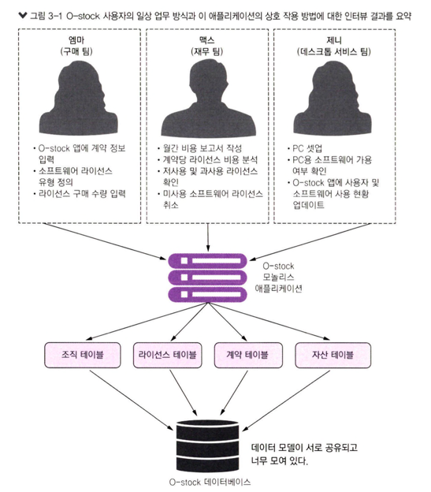
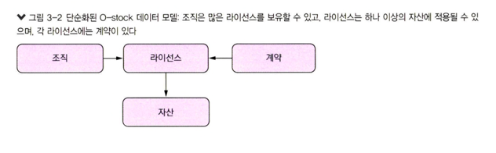
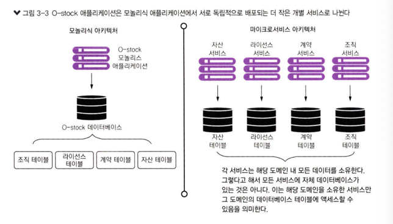
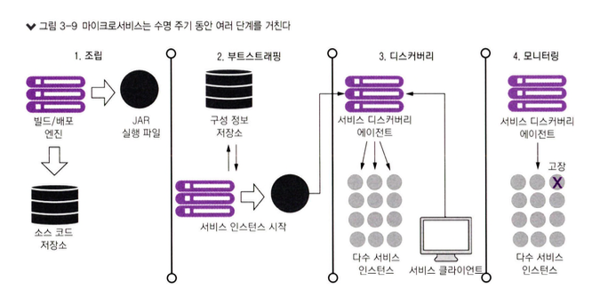
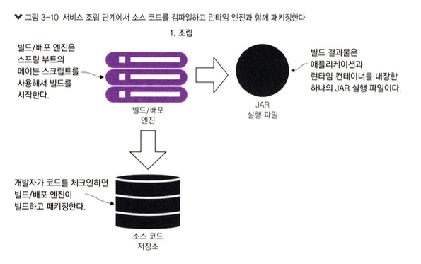
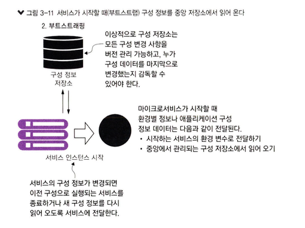
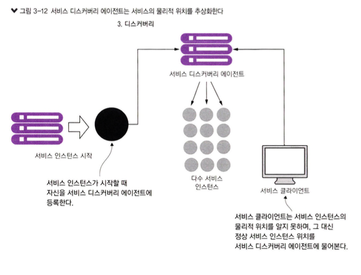
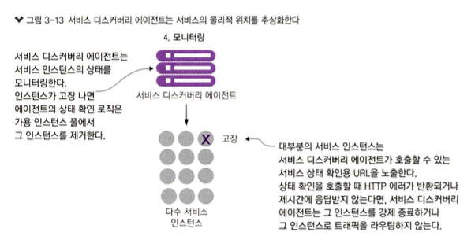

# 3. 스프링 부트로 마이크로서비스 구축하기

## 3.1 아키텍트 이야기 : 마이크로서비스 아키텍처 설계
- **아키텍트**는 애플리케이션의 각 부분이 잘 조립될 수 있도록 개발자가 작성할 코드 에대한 `스캐폴드`를 제공
- 마이크로서비스를 구축할때 프로젝트의 **아키텍트**는 다음 세가지 핵심 업무에 집중
  - `비즈니스 문제 분해`
  - `서비스 세분화 확정`
  - `서비스 인터페이스 정의`
### 3.1.1 비즈니스 문제 분해
- **비즈니스 문제를 기술하는 데 사용된 명사에 주목하라**
  - `계약`, `라이선스`, `자산`
- **동사에 주목하라**
  - 핵심 동사는 `조회하다` 와 `업데이트하다` 이다.
- **데이터 응집성을 찾아라**
  - 비즈니스 문제를 개별 부분으로 나눌 때 서로 **연관성이 높은 데이터 부분을 찾아야 한다.**
  - 마이크로서비스는 완전히 자기 데이터를 가져야 하기 때문이다.  

[그림 3-1] 명사 & 동사 요약 정리  
              
출처 : 길벗 - 스프링 마이크로서비스 코딩 공작소 개정2판  

[그림 3-2] 고객과 나눈 대화를 기반으로 단순화한 데이터 모델  
              
출처 : 길벗 - 스프링 마이크로서비스 코딩 공작소 개정2판

### 3.1.2 서비스 세분화 확정
- 데이터 모델을 단순화 => 마이크로서비스를 정의하는 과정을 시작
- **목표**는 이러한 주요 기능 부분을 서로 **독립적으로 빌드하고 배포**할 수 있는 완전한 `자립형 유닛`으로 추출
  - `유닛`은 데이터베이스를 공유하거나 개별적으로 가질 수 있다

- [그림 3-2] 애플리케이션 **코드**와 **데이터 모델**이 개별 조각으로 나뉨
            
출처 : 길벗 - 스프링 마이크로서비스 코딩 공작소 개정2판    

#### [올바른 세분화 수준에 대한 정답]
- **마이크로서비스는 광범위하게 시작하고 더 작은 서비스로 리팩터링하는 것이 좋다**
  - 문제 영역을 작은 서비스로 분해하면 마이크로서비스가 작은 데이터 서비스로 전락할 수 있다.
- **서비스 간 교류하는 방식에 중점을 둔다**
  - `문제 도메인(영역)`에 대한 `큰단위의 인터페이스를 만드는 데 도움`이 된다.
  - 큰 것을 작게 리팩터링하는 것이 더 쉽다.
- **문제 도메인에 이해가 깊어지면서 서비스 책임도 계속 변한다**
  - 마이크로서비스는 단일 서비스로 시작 하여 여러 서비스로 분화되며 성장
  - 원래 서비스는 새로운 서비스들을 오케스트레이 션하고 애플리케이션의 다른 부분 기능을 캡슐화하는 역할
----
> [마이크로서비스 구축] 
> **계층별 분해**
> - UI 분해
> - 코드 우선 분해
> - 데이터 우선 분해
>   - 성능, 데이터 무결성, 트랜잭션
> **분해 패턴**
> - 교살자 무화과 패턴 : 모놀리스+MSA 동시운영(시스템의 일부를 점진적으로 대체)
> - 병렬 실행 : 모놀리식 기능과 새로운 마이크로서비스 기능을 나란히 실행해, 같은 요청을 제공하고 결과를 비교
> - 기능 토글

#### [너무 큰 마이크로서비스의 징후]
- **책임이 너무 많은 서비스**
- **다수 테이블에 걸쳐 데이터를 관리하는 서비스**
  - 여러 테이블에 데이터를 유지하거나 서비스의 데이터베이스 외부에 있는 테이블에 접근한다면 서비스가 너무 크다는 징조
  - `필자`는 마이크로서비스가 **3〜5개 이하의 테이블을 소유해야 한다는 지침**을 사용
- **테스트가 너무 많은 서비스**
  - 서비스는 시간이 지남에 따라 규모와 책임이 커질 수 있다

#### [너무 작은 마이크로서비스의 징후]
- **문제 도메인의 한 부분에 속한 마이크로서비스가 토끼처럼 번식한다**
  - 모든 것이 마이크로서비스가 되면 서비스에서 비즈니스 로직을 구성하는 것이 복잡하고 어려워진다.
  - 작업을 완료하는 데 필요한 서비스 수가 엄청나게 증가한다.
- **마이크로서비스가 지나치게 상호 의존적이다**
- **마이크로서비스가 단순한 CRUD 서비스 집합이 된다**

### 3.1.3 서비스 인터페이스 설계
**인터페이스는 직관적이어야 한다.**

- REST 철학을 수용하라.
  - GET(조회), POST(생성), PUT(전체 수정), PATCH(부분 수정), DELETE(삭제)
  - **리처드슨의 성숙도 모델** (RESTful 서비스의 수준을 나타내는 모델)
  ````text
  - 레벨 0: POX(Plain Old XML)
    - `HTTP를 단순히 전송 수단으로 사용`
  - 레벨 1: 리소스 식별(URI)
    - `리소스에 대해 유일한 식별자(URI)를 사용`하여 리소스를 표현
    - ex) /post/{id}
  - 레벨 2: HTTP 메서드 활용
    - `URI Resources + HTTP Method`
      - 세 번째 단계에서는 HTTP 메서드(GET, POST, PUT, DELETE 등)를 활용하여 CRUD(Create, Read, Update, Delete) 작업을 수행
    - ex) GET /post/1 (조회), DELETE /post/1 (삭제)
  - 레벨 3: `하이퍼미디어 컨트롤(HATEOAS)`
    - 하이퍼미디어 컨트롤(Hypermedia as the Engine of Application State, HATEOAS)을 적극적으로 활용
    - 클라이언트가 서버로부터 받은 리소스를 통해, `다음 가능한 동작을 결정`할 수 있게 해준다.
  ````
  - 서비스에 대한 REST 접근 방식은 표준 HTTP 동사(GET, PUT, POST, DELETE)를 사용하면서 서비스 호출 프로토콜로 HTTP를 수용하는 것이 핵심
- URI를 사용하여 의도를 전달하라.
- 요청과 응답에 JSON을 사용하라.
- HTTP 상태 코드로 결과를 전달하라.
  - 서비스 호출의 성공과 실패를 명시 하는 풍부한 표준 응답 코드 사용

## 3.2 마이크로서비스를 사용하지 말아야 할 때
- 분산 시스템 구축의 복잡성
- 가상 서버나 컨테이너 스프롤(실제 작업량 보다 더 많은 공간과 리소스를 차지 하는 현상)
- 애플리케이션 타입
- 데이터 트랜잭션과 일관성
### 3.2.1 분산 시스템 구축의 복잡성
- 모놀리식 애플리케이션에서 없던 **복잡성 발생**
- **높은 운영 성숙도도 필요**
- 조직에서 고도로 분산된 애플리케이션을 성공시키는 데 필요한 **자동화**와 **운영 작업**(모니터링, 확장 등)에 기꺼이 투자하지 않는 한 마이크로서비스 사용을 고려하지 않는 편이 좋다.

### 3.2.2 서버 또는 컨테이너 스프롤
- 마이크로서비스의 가장 일반적인 배포 모델은 **컨테이너당 하나의 마이크로서비스 인스턴스를 배포**
- 서버를 관리하고 모니터링하는 운영 작업은 엄청나게 복잡
> 마이크로서비스의 유연성은 이 서버들을 모두 실행하는 비용과 비교해 보아야 한다. 
> 람다 같은 함수 개발 을 고려하거나 동일한 서버에 더 많은 인스턴스를 추가하는 것처럼 다른 대안이 있을 수 있다.

### 3.2.3 애플리케이션 타입
- 부서 수준의 **소규모 애플리케이션**이나 **적은 사용자 기반의 애플리케이션**을 만들 때 마이크로서비스와 같은 분산 모델로 구축한다면 연관된 복잡성 때문에 그 가치보다 더 많은 비용이 발생할수 있다
- 마이크로서비스는 `재사용성`을 추구하며 `고도의 회복성과 확장성`이 필요한 대규모 애플리케이션을 구축하는 데 매우 유용한 아키텍처이다.
### 3.2.4 데이터 트랜잭션과 일관성
- 애플리케이션이 여러 데이터 소스에 걸쳐 복잡한 데이터를 집계하고 변환해야 한다면 마이크로서비스의 분산된 특성으로 이 작업은 어려워진다

## 3.3 개발자 이야기 : 스프링 부트와 자바
### 3.3.1 마이크로서비스의 출입구 만들기: 스프링 부트 컨트롤러
- 스프링 부트 애플리케이션에서 `Controller 클래스`는 서비스의 **엔드포인트를 노출**
> **잠시 REST하세요**
> - `HTTP/HTTPS`를 서비스에 대한 호출 프로토콜로 사용
> - 서비스 동작을 표준 `HTTP 동사(verb)에 매핑`
>   -  POST, GET, PUT. DELETE
> - 서비스 입출력 데이터의 직렬화 형식으로 `JSON`을 사용
>   - JSON은 마이크로서비스가 주고받는 데이터를 직렬화할 수 있는 **공용어**
> - 서비스 호출 상태를 전달하는 데 `HTTP 상태 코드`를 사용

> 왜 마이크로서비스에 JSON을 사용하는가?
> - 다른 프로토콜(ex, soap)에 비해 JSON은 매우 가볍다.
> - JSON은 사람이 쉽게 읽고 사용할 수 있다.
> - JSON은 자바스크립트에 사용되는 기본 직렬화 프로토콜이다.
> - 서비스 간 통신을 하는데 JSON보다 더 효율적인 다른 메커니즘과 프로토콜이 있다.
>   - 아파치 쓰리프트/아프로 => 바이너리 포맷
>   - 데이터 크기를 최소화할 필요가 있다면 검토
>   - but, 필자 경험상 JSON을 직접 사용하는것이 효과적이였다.

> 엔드포인트 이름이 중요하다.
> - 마이크로서비스 개발 진행 전 서비스가 노출하는 엔드포인트에 대한 표준을 수립했는지 확인해야 한다.
> - 마이크로서비스의 URL은 서비스 의도, 서비스가 관리하는 리소스, 서비스 안에서 관리되는 리소스 간 관계를 명확히 커뮤니케이션하는 데 사용해야 한다.
>   - 서비스가 표현하는 리소스에 명확한 URL 이름을 사용하라.
>     - /users
>     - /{productId}
>   - URL을 사용해서 리소스 간 관계를 설정하라.
>     - 대개 마이크로서비스 내 리소스 사이에는 부모-자식 관계가 생긴다
>     - URL이 길고 중첩되어 있다면 마이크로서비스가 너무 많은 일을 하고 있는 것일 수 있다.
>     - /users/{userId}/orders
>     - /products/{productId}/reviews
>   - URL 버전 체계를 일찍 세워라.
>     - 조기에 버전 체계를 수립하고 준수하자.
>     - /v1/products/{productId}

### 3.3.2 라이선싱 서비스에 국제화 추가하기
### 3.3.3 관련 링크를 표시하는 스프링 HATEOAS 구현
- `스프링 HATEOAS`는 HATEOAS 원칙(해당 리소스와 관련된 링크를 표시하는)을 준수하는 API를 생성하는 프로젝트다.
  - API는 각 서비스 응답과 함께 가능한 다음 단계 정보도 제공하며, 클라이언트를 `다음 단계`로 **가이드**할 수 있어야 한다.

## 3.4 데브옵스 이야기 : 혹독한 런타임 구축
- `마이크로서비스는 일체형이어야 한다`
  - 하나의 소프트웨어 산출물, 여러 인스턴스를 **독립적으로 배포**
- `마이크로서비스는 구성 가능해야 한다.`
  - 서비스 인스턴스가 시작하면 필요한 구성 정보를 한곳에서 읽어 오거나 환경 변수로 전달받아야 한다.
  - 서비스 구성 정보를 설정하 는 데 사람의 개입이 없어야 한다.
- `마이크로서비스 인스턴스는 클라이언트에 투명해야 한다.`
  - 클라이언트는 서비스의 정확한 위치를 알고 있어서는 안 된다.
  - 마이크로서비스 클라이언트는 **서비스 디스커버리 에이전트와 통신**해야 한다.
- `마이크로서비스는 자기 상태를 전달해야 한다.`
  - 마이크로서비스 인스턴스는 고장 날 수 있으며 **디스커버리 에이전트는 고장 난 인스턴스를 우회해서 라우팅**해야 한다.

> 자체 컨테이너에서 독립적으로 실행 => 정교한 조정 기술을 필요로 하고 더 많 은 장애

#### 데브옵스 관점
- **서비스 조립**
  - `동일한 서비스 코드`와 `런타임`이 정확히 동일한 방식으로 배포
- **서비스 부트스트래핑**
  - 런타임 코드에서 애플리케이션 코드와 `환경별 구성 코드를 분리`
  - spring cloud config, k8s configmap, aws secret manger, hasicorp valut
- **서비스 등록 및 디스커버리**
  - 새 마이크로서비스 인스턴스가 배 포될 때 애플리케이션 클라이언트가 새 서비스 인스턴스를 발견
- **서비스 모니터링**
  - 마이크로서비스 인스턴스를 모니터링해야 하며 장애가 발생한 서비스 인스턴스를 우회해서 라우팅

- [그림 3-9] 마이크로서비스는 주명 주기 동안 여러 단계를 거친다
              
  출처 : 길벗 - 스프링 마이크로서비스 코딩 공작소 개정2판   

### 3.4.1 서비스 조립: 마이크로서비스의 패키징과 배포
- 데브옵스 관점, 마이크로서비스 아키텍처 핵심 개념은 애플리케이션의 환경 변화에 대응하여 많은 서비스를 신속히 배포
  - 이를위해 마이크로서비스는 `모든 의존성`을 포함한 단일 산출물로 패키징되고 설치
- [그림 3-10] 서비스 조립 단계에서 소스 코드를 컴파일, 런타임 엔진과 함께 패키징
              
  출처 : 길벗 - 스프링 마이크로서비스 코딩 공작소 개정2판  

### 3.4.2 서비스 부트스트래핑: 마이크로서비스의 구성 관리
- `서비스 부트스트래핑`은 마이크로서비스가 처음 시작하고 **애플리케이션 구성 정보를 로드**할 때 일어난다.
- [그림 3-11] 서비스가 시작할 때(부트스트랩) 구성 정보를 중앙 저장소에서 읽어온다.
              
  출처 : 길벗 - 스프링 마이크로서비스 코딩 공작소 개정2판    

[런타임 동작 구성]
- 배포된 `프로퍼티 파일`, `데이터베이스` 에서 구성 데이터를 읽을 수 있다.
- 수백 또는 수천 개의 마이크로서비스가 실행될수 있고, 전 세계로 확장될 수 있다.

[클라우드의 마이크로서비스 상황 에서는 다음 몇 가지 고유한 난제]
> - 구성 데이터는 보통 단순한 키-값 구조, RDBMS의 데이터 모델을 필요로 하지 않음. RDBMS는 이 경우 과잉 설계.  
> - 데이터의 읽기 지연 시간은 낮아야 한다.  
> - 데이터 저장소는 **고가용성**을 유지하고 데이터를 읽는 서비스에 가까워야 한다.   

### 3.4.3 서비스 등록과 디스커버리: 클라이언트가 마이크로서비스와 통신하는 방법
- 마이크로서비스는 `위치 투명성`을 가져야 한다. => 클라우드 기반 환경에서 서버는 일시적
- 대규모 서비스를 수동 또는 직접 관리하면서 장애를 초래할 수 있다.
- 마이크로서비스 인스턴스는 제삼자 에이전트에 자신을 등록한다.
  - 등록 과정을 `서비스 디스커버리`라고 한다.
- 마이크로서비스 인스턴스가 서비스 디스커버리 에이전트에 등록될 때, 인스턴스는 에이전트에 다음 **두 가지 정보를 제공**
  - `물리적 IP 주소`(또는 서비스 인스턴스의 도메인 주소)
  - 애플리케이션이 서비스를 찾을 때 사용되는 `논리적 이름`
  - 특정 서비스 디스커버리 에이전트의 경우 상태 확인(헬스체크)을 수행하는 데 사용할 호출 가 능한 URL을 등록
- [그림 3-12] 서비스 디스커버리 에이전트는 서비스의 물리적 위치를 추상화한다.
              
  출처 : 길벗 - 스프링 마이크로서비스 코딩 공작소 개정2판  
### 3.4.4 마이크로서비스의 상태 전달
- **서비스 디스커버리 에이전트**는 등록된 각 서비스 `인스턴스 상태를 모니터링`하고 라우팅 테이블에서 `실패한 서비스 인스턴스를 제거`하여 클라이언트가 실패한 서비스 인스턴스와 통신하지 않도록 한다.
  - 마이크로서비스가 시작된 후 `서비스 디스커버리 에이전트`는 해당 서비스가 가용한지 확인하고자 지속적으로 모니터링하고 **상태 확인 인터페이스를 핑**(ping)한다.

- [그림 3-13] 서비스 디스커버리 에이전트는 서비스의 물리적 위치를 추상화한다
               
  출처 : 길벗 - 스프링 마이크로서비스 코딩 공작소 개정2판    

- 스프링 부트에서 상태 확인 인터페이스
  - `스프링 액추에이터`는 서비스 상태를 이해하고 관리

## 3.5 모든 관점 통합하기
- 클라우드의 마이크로서비스를 성공하려면, 종합된 비전을 달성하는 `관점의 통합이 필요`
  - **아키텍트**
    - 크게 나눈 마이크로서 비스에서 시작해서 작은 서비 스로 리팩터링하는 것이 낫다
  - **소프트웨어 엔지니어(개발자)**
    - 서비스 안의 각 계층마다 책임이 분리된 계층화된 서비스를 구축하는 데 집중하라.
    - 코드에서 프레임워크를 만들려는 유혹을 피하고, 완전히 **독립적인 마이크로서비스**를 지향하라 => 질문
  - **데브옵스 엔지니어**
    - 서비스의 수명 주기를 조기에 수립하라.
    - 데브옵스 관점에서 서비스 빌드와 배포를 자동화 해야 한다.
    - 서비스 상태를 모니터링하고 문제가 발생할 때 대응하는 방법에도 주목해야한다.
## 3.6 요약
- 마이크로서비스의 성공을 위해 `아키텍트`, `소프트웨어 개발자`, `데브옵스` 이 세 팀의 관점을 통합
- 마이크로서비스는 강력한 아키텍처 패러다임이지만 장단점
- 마이크로서비스는 일반적으로 REST 스타일 디자인을 사용, 페이로드로 JSON을 사용
- HATEOAS
- 데브옵스 관점에서 마이크로서비스를 패키징, 배포, 모니터링하는 방법은 매우 중요
- 스프링 액추에이터는 서비스의 런타임 정보와 함께 서비스의 운영 상태 정보도 제공