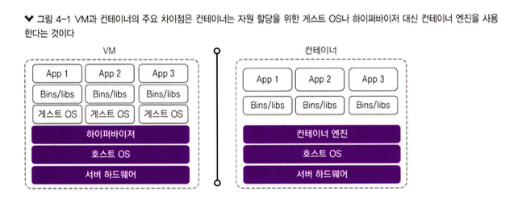
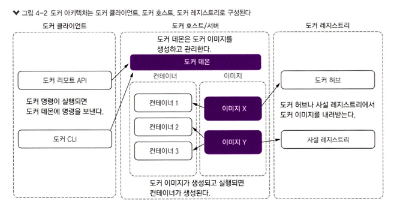
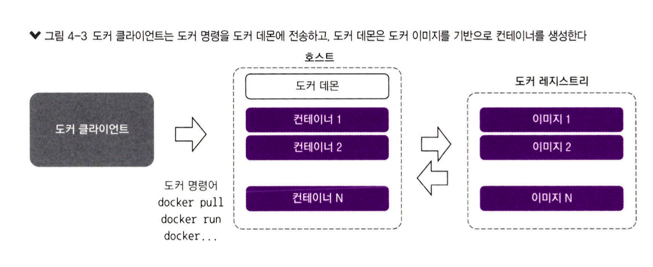
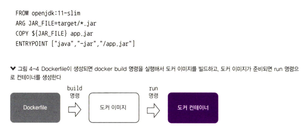
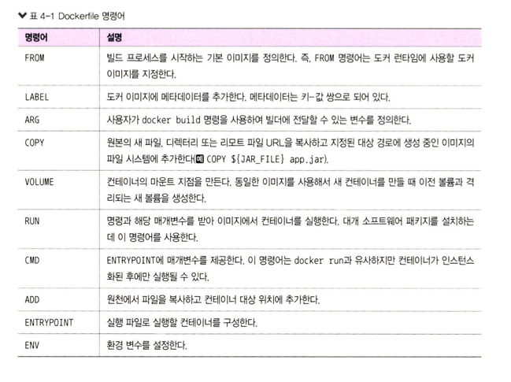
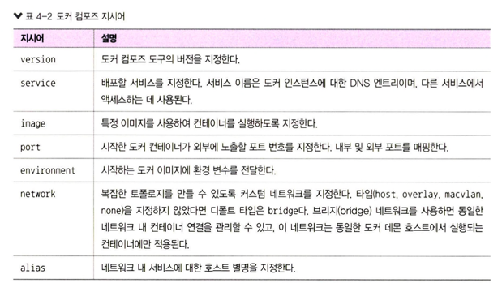
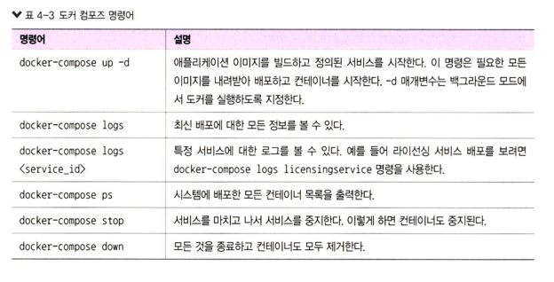
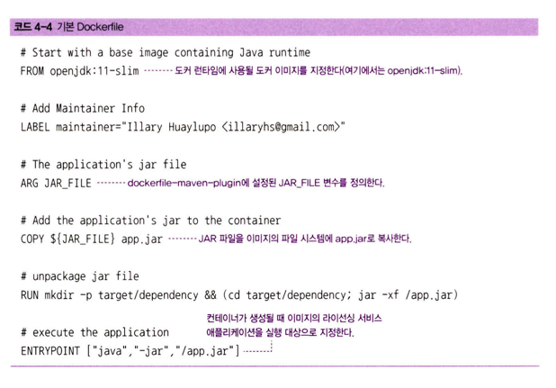
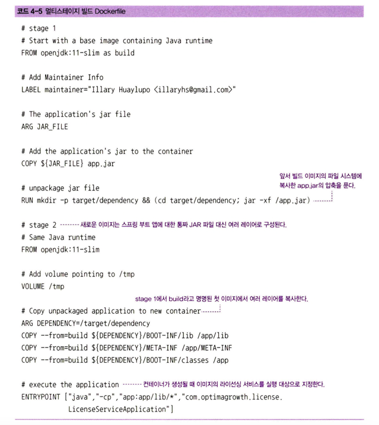

# 4. 도커
- 마이크로서비스를 성공적으로 유지하려면 **이식성**이 중요하다.
- 최근 컨테이너는 **필수적**인 것으로 바뀌고 있다.
  - 컨테이너를 사용하면 다른 플랫폼으로 빠르고 유용한 방법으로 이전하고 실행 가능하다.
  - 컨테이너는 마이크로서비스에 **이식성**, **확장성** 같은 이점을 제공한다.
- `도커(Docker)`가 주요한 클라우드 공급자 모두와 호환되는 기술

## 4.1 컨테이너 또는 가상 머신?
- VM은 한 컴퓨터 내에서 다른 컴퓨터 동작을 에뮬레이션할 수 있는 소프트웨어
  - 물리 머신을 에뮬레이션하는 **하이퍼바이저** 기반
  - 하이퍼바이저는 시스템 메모리, 프로세서 코어, 디스크 스토리지 및 네트워크, PCI 애드온 등 다른 기술 자원을 할당
- 컨테이너는 격리되고 독립된 환경에서 애플리케이션의 의존성 구성 요소와 함께 애플리케이션을 실행할 수 있는 가상 운영 체제가 포함된 패키지

[그림 4-1] VM과 컨테이너의 차이  
             
출처 : 길벗 - 스프링 마이크로서비스 코딩 공작소 개정2판  

- VM에서는 사전에 필요한 물리적 자원량을 설정
  - 사용할 가상 프로세서 수, 램 또는 디스크 스페이스 용량 설정
- 컨테이너 
  - 컨테이너는 기본 OS를 재사용할 수 있어 완전한 OS가 필요하지 않다.
  - 따라서, 컨테이너는 VM보다 훨씬 가볍다.
- 결과적으로 두 기술은 모두 장단점이 있으며, 결정은 요구 사항에 달려 있다

[마이크로서비스와 함께 컨테이너를 사용시 이점]
- 컨테이너는 어디에서나 실행할 수 있어 개발 및 구현이 용이하고 **이식성**을 높여준다.
- 컨테이너는 다른 애플리케이션과 **완전히 격리된 예측 가능한 환경을 생성**해 주는 기능을 제공
- 컨테이너는 **VM보다 더 빠르게 시작하고 중지**할수있어 클라우드네이티브가 가능하다. 
- 컨테이너는 확장 가능하고 **자원 활용을 최적화**하는 데 **능동적으로 스케줄링**하고 관리할 수 있어 컨테이너 내부에서 실행되는 애플리케이션의 성능과 유지 보수성을 높인다. 
- 최소 서버로 가능한 많은 애플리케이션을 실행할 수있다.

## 4.2 도커란?
- 리눅스 기반의 **오픈 소스 컨테이너 엔진**
- 도커 엔진이 시스템의 핵심부이다.

[그림 4-2] **도커 아키텍처**는 도커 클라이언트, 도커 호스트, 도커 레지스트리로 구성된다.
             
출처 : 길벗 - 스프링 마이크로서비스 코딩 공작소 개정2판    
- **도커 데몬**(Dockcr daemon)
  - 도커 이미지를 생성하고 관리하는 dockerd라는 서버
  - REST API가 데몬에 명령을 보내고 CLI 클라이언트가 도커 명령을 입력
- **도커 클라이언트**(Docker client)
  - 도커 사용지는 클라이언트로 도커와 상호 작용한다
  - 도커 명령이 실행되면 클라이언트는 데몬에 명령을 보내는 역할을 수행
- **도커 레지스트리**(Docker registry)
  - 도커 이미지가 저장되는 곳
  - 이 레지스트리는 공개 또는 사설 레지스트리 이다.
  - 도커 허브(Docker Hub)는 기본 공개 레지스트리이고 전용 사설레지스트리를 만들 수 있다.
- **도커 이미지**(Docker images)
  - 도커 컨테이너를 생성하는 몇 가지 명령이 포함된 읽기 전용 템플릿이다. 
  - 이미지는 도커 허브에서 가져올 수 있고 그대로 사용하거나 추가 명령으로 수정 할 수 있다. 
  - Dockerfile을 사용해서 새로운 이미지를 생성할 수도 있다.
- **도커 컨테이너**(Docker containers)
  - docker run 명령이 생성되고 수행되면 도커 이미지는 컨테이너를 생성
  - 도커 컨테이너 를 시작, 중지, 삭제 하려면 도커 API나 CLI를 사용
- **도커 볼륨**(Docker volume)
  - 도커 볼륨은 도커가 생성하고 컨테이너가 사용한 데이터를 저장 하는 데 사용 
  - 도커 API나 CLI로 관리된다.
- **도커 네트워크**(Docker networks)
  - Docker 컨테이너 간의 통신을 관리하고 격리하기 위한 기능을 제공하는 것 => 같은 호스트 내에서 실행중인 컨테이너 간 연결, 논리적 네트워크 개념
  - 도커 에는 bridge, host, overlay, none, macvlan의 다섯 가지 네트워크 드라이버 타입이 있다.

[그림 4-3] 도커의 작동 방식
- 도커 데몬이 모든 컨테이너 활동을 담당
  - 데몬은 클라이언트에서 명령을 받고 CLI나 REST API로 명령을 전달
  - 도커 데몬은 도커 이미지를 기반으로 컨테이너를 생성  
               
출처 : 길벗 - 스프링 마이크로서비스 코딩 공작소 개정2판   

## 4.3 Dockerfiles
- Dockerfile(도커 파일)은 **도커 클라이언트가 이미지를 생성**하는 `지시어`와 `명령어`들이 포함된 단순한 테스트 파일
  - 이미지 생성 과정을 자동화  

[그림 4-4]  
               
출처 : 길벗 - 스프링 마이크로서비스 코딩 공작소 개정2판  

[표 4-1] Dockerfile 명령어  
                 
출처 : 길벗 - 스프링 마이크로서비스 코딩 공작소 개정2판  

## 4.4 도커 컴포즈
- **도커 컴포즈**(Docker Compose)
  - 스크립트를 작성하여 도커를 더 쉽게 사용
  - 여러 컨테이너를 하나의 서비스로 실행, 다른 컨테이너를 동시에 생성

````yaml
version: <docker-compose-version> 
services:
  database:
    image: <database-docker-image-name> 
    ports:
      - "<databasePort>:<databasePort>" 
  environment:
    POSTGRES_USER: <databaseUser> 
    POSTGRES_PASSWORD: <databasePassword> 
    POSTGRES_DB: <databaseName>
    
  <service-name>:
    image: <service-docker-image-name> 
    ports:
      - "<applicationPort>:<applicationPort>" 
    environment:
      PROFILE: <profile-name> 
      DATABASESERVER_PORT: "<databasePort>"

    container_name: <container_name> 
      networks:
      backend: 
      aliases:
         - "alias"
networks:
  backend:
    driver: bridge
````
[표 4-2] 도커 컴포즈 지시어  
     
[표 4-3] 도커 컴포즈 명령어  
     
출처 : 길벗 - 스프링 마이크로서비스 코딩 공작소 개정2판   

## 4.5 마이크로서비스와 도커 통합하기
### 4.5.1 도커 이미지 만들기
#### 기본 Dockerfile
[표 4-4] 기본 Dockerfile  
     
출처 : 길벗 - 스프링 마이크로서비스 코딩 공작소 개정2판  

#### 멀티스테이지 빌드 Dockerfile
- 멀티스테이지 빌드
  - 애플리케이션 실행에 필수적이지 않은 것을 제외할 수 있다.
  - 이 방식은 생성할 도커 이미지를 최적화

[표 4-5] 멀티스테이지 빌드 Dockerfile  
       
출처 : 길벗 - 스프링 마이크로서비스 코딩 공작소 개정2판  
- openJDK 이미지에서 build라고 명명된 이미지를 생성 => JAR 애플리케이션 파일 을 생성하고 압축을 푸는 역할
- JAR 파일을 이미지 파일 시스템에 app.jar로 복사하고 압축을 풀어 스프링 부트 애플리케이션에 포함된 여러 레이어를 뽑아낸다
- 레이어가 추출되면 Dockerfile은 전체 애플리케이션 JAR 대신 이들 레이어만 포함된 또 다른 이미지
- 두 번째 스테이지에서 Dockerfile은 여러 레이어를 새 이미지에 복사


### 4.5.2 스프링 부트로 도커 이미지 생성하기
#### 빌드팩
- 빌드팩(Buildpack)은 애플리케이션 및 프레임워크 의존성을 제공하는 도구로, 소스 코드를 실행 가능한 애플리케이션 이미지로 변환
- 스프링부트 2.3.0은 클라우드 네이티브 빌드팩을 사용하여 을사용해서도커이미지 를 빌드할 수 있도록 지원 
#### 레이어로 분해된 JAR
- 스프링 부트는 레이어로 나뉜JAR(layered JAR)라는 새로운 JAR 레이아웃을 도입
- 레이어로 분리한 것은 빌드에 필 요한 정보를 남겨 두고 빌드 간 변경될 가능성에 따라 코드를 나누기 위해
### 4.5.3 도커 컴포즈로 서비스 실행하기
- **도커 컴포즈**는 도커 설치 과정의 일부로 설치되며 **서비스를 그룹으로 정의**한 후 단일 단위로 시작 할 수 있는 **서비스 오케스트레이션 도구**
````shell
docker-compose up
````
## 4.6 요약 
- **컨테이너**를 사용하면 개발자 컴퓨터부터 물리 또는 가상의 엔터프라이즈 서버까지 모든 환 경에서 개발 중인 소프트웨어를 성공적으로 실행
- **도커**는 리눅스 컨테이너를 기반으로 하는 인기 있는 오픈 소스 컨테이너 엔진
- 도커는 도커 엔진, 클라이언트, 레지스트리. 이미지. 컨테이너, 볼륨, 네트워크라는 요소로 구성
- Dokerfile은 도커 클라이언트가 이미지를 생성하고 준비하고자 호출하는 지시와 명령어 가 포함된 단순한 텍스트 파일
- 도커컴포즈는 서비스를 그룹으로 정의하고 단일단위로 함께시작할 수 있게 해 주는 서비스 오케스트레이션 도구


             
출처 : 길벗 - 스프링 마이크로서비스 코딩 공작소 개정2판    