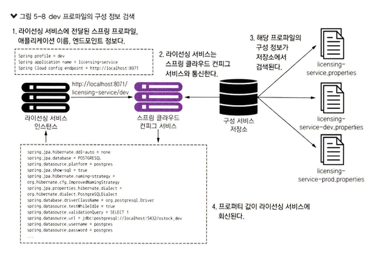
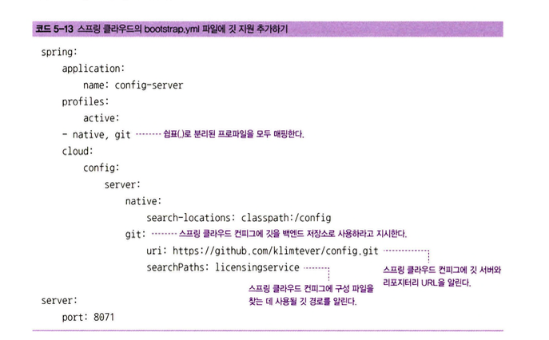

# 5. 스프링 클라우드 컨피그 서버로 구성 관리
- `애플리케이션 구성 정보`와 **코드를 분리하는 것은 중요**하다.
  - 분리 될시, 구성이 변경 될때 마다 컴파일 및 배포 불필요
- 많은 개발자가 `프로퍼티 파일(YAML, JSON, XML)`을 사용해 구성 정보를 저장한다. 
  - 애플리케이션 수가 적은 경우 효과가 있을수 있다.
  - 하지만, 수백 개의 서비스가 있을 경우에는 이 방식은 문제가 된다.

> 클라우드 기반 마이크로서비스 개발을 위한 모범 사례
> - 코드와 구성 정보를 완전히 분리한다.
> - 여러 환경에서도 절대 변경되지 않는 **불변 애플리케이션 이미지를 빌드**한다.
> - 서버가 시작할 때, **환경변수** 또는 **중앙 저장소**를 통해 **모든 애플리케이션 구성 정보를 주입**한다.

## 5.1 구성(그리고 복잡성) 관리
- 서비스 배포를 위해 수동으로 구성하거나 건드릴 경우 실수가 있을 수 있음.
  - 구성 불일치(configuration drift), 예기치 않은 장애, 확장시 위한 지연 시간 발생
- **구성 관리를 위해 지킬 네 가지 원칙**
  - `분리`
    - 서비스 물리적 배포에서 서비스 **구성 정보를 완전히 분리**해야 한다.
  - `추상화`
    - 애플리케이션 구성 정보를 조회하는 데 저장소(파일, DB)를 직접 읽기 보다는, 데이터 접근 방식을 추상화하여 **REST기반 JSON을 사용**해야 한다.
  - `중앙 집중화`
    - **가능한 적은 수의 저장소**로 애플리케이션 구성 정보를 모아야 한다.
  - `견고화`
    - 애플리케이션 구성 정보는 중앙 집중화되므로, **가용성**이 높고 **이중화**가 필요하다.
- **명심해야 할 핵심 사항 중 하나**
  - `애플리케이션 구성 데이터`는 `추적 가능`하며, `버전을 제어`할 수 있어야 한다.

### 5.1.1 구성 관리 아키텍처
[그림 5-1] 애플리케이션 구성 데이터는 **서비스 부트스트래핑 단계**에서 읽힌다.
      
출처 : 길벗 - 스프링 마이크로서비스 코딩 공작소 개정2판    

[그림 5-2] 상세한 부트스트래핑 과정
     
출처 : 길벗 - 스프링 마이크로서비스 코딩 공작소 개정2판    
1. 인스턴스가 시작되면, 환경별 구성 정보를 읽어 온다
2. 구성 정보는 저장소(파일, DB, key-value 저장소)에 보관된다.
3. 구성 관리에 대한 변경 사항은 빌드 및 배포 파이프라인으로 처리
4. 구성 정보가 변경시, 서비스는 변경 사항을 통지받고 애플리케이션 데이터 복제본을 갱신 해야 한다.

### 5.1.2 구현 솔루션 선택
[표 5-1] 구성 관리 솔루션
         
출처 : 길벗 - 스프링 마이크로서비스 코딩 공작소 개정2판  
- 책 에서는 `스프링 클라우드 구성 서버(Spring Cloud Configuration Server)`를 채택

## 5.2 스프링 클라우드 컨피그 서버 구축
- 스프링 클라우드 컨피그 서버는 `REST 기반`의 **애플리케이션** 이다.
- 부트스트랩(bootstrap) 파일은, `애플리케이션 이름`, `스프링 클라우드 구성 서버 위치`, `암호화/복호화 정보` 등을 지정한다.
  - application.properties나 application.yml 파일을 사용하는 컴포넌트보다 먼저 로드

````yaml
spring:
  application:
    name: config-server #컨피그 서버 애플리케이션 이름 
server:
  port: 8071 #서버 포트
````

### 5.2.1 스프링 클라우드 컨피그 부트스트랩 클래스 설정
- 부트스트랩 클래스를 설정
````java
@SpringBootApplication
@EnableConfigServer //이 서비스룰 스프링 클라우드 컨피그 서비스로 활성화
public class ConfigurationServerApplication {
	public static void main(String[] args) {
		SpringApplication.run(ConfigurationServerApplication.class, args);
	}
}
````

### 5.2.2 스프링 클라우드 컨피그 서버에 파일 시스템 적용
- `스프링 클라우드 컨피그 서버`는 bootstrap.yml 파일에서 애플리케이션의 **구성 데이터를 보관할 저장소를 지정**한다.
````yaml
spring:
  application:
    name: config-server
  profiles:
    active: native #백엔드 저장소(파일시스템)와 관련된 스프링 프로파일을 설정한다.

  cloud:
    config:
      server:
      # 로컬 구성 정보: classpath 위치나 파일 시스템의 위치가 될 수 있다.
        native:
        # 특정 파일 시스템 폴더에서 읽어 온다.
          search-locations: file:///(FILE_PATH) #구성 파일이 저장된 검색 위치를 설정한다.
          #search-locations: classpath:/config 클래스패스
server:
  port: 8071
````
### 5.2.3 서비스의 구성 파일 설정
[그림 5-5] 컨피그 서비스를 설정&사용 하는 방법
         
출처 : 길벗 - 스프링 마이크로서비스 코딩 공작소 개정2판  

> 구현 전 생각하라
> - 중대형 클라우드 애플리케이션에는 파일 시스템 기반 솔루션을 권장하지 않는다.

- http://localhost:8071/licensing-service/dev
  - default와 dev의 구성 프로퍼티를 모두 반환
         
출처 : 길벗 - 스프링 마이크로서비스 코딩 공작소 개정2판  

## 5.3 스프링 클라우드 컨피그와 스프링 부트 클라이언트 통합
- `라이선싱 서비스 부팅`시, 전달된 스프링 프로파일에 설정된 엔드포인트로 `스프링 클라우드 컨피그 서비스와 통신`
- 스프링 클라우드 컨피그 서비스, 구성된 백엔드 저장소(파일 시스템. 깃, 볼트)를 사용하여 URI에 매개변수로 전달된 스프링 프로파일에 해당하는 구성 정보를 검색
           
출처 : 길벗 - 스프링 마이크로서비스 코딩 공작소 개정2판    

### 5.3.1 라이선싱 서비스의 스프링 클라우드 컨피그 서비스 의존성 설정
````xml
<!-- 
spring-cloud-starter-config는 스프링 클라우드 컨피그 서버와 통신하는 데 필요한 모든 클래스를 포함
-->
<dependency>
    <groupld>org.springframework.cloud</groupld> 
    <artifactld>spring-cloud-starter-config</artifactld>
</dependency>
````

### 5.3.2 스프링 클라우드 컨피그 사용을 위한 라이선싱 서비스 구성
````yaml
spring:
    application:
     name: licensing-service
    profiles:
      active: dev #실행될 프로파일 지정
    cloud:
        config: 
            uri: http://configserver:8071 #스프링 클라우드 컨피그 서버 위치 지정
````
- spring.application.name은 애플리케이션 이름(licensing-service)이며, 스프링 클라우드 컨피그 서버 내 `config 디렉터리 이름과 직접적으로 매핑`
- **프로파일**은 스프링 부트 애플리케이션에서 사용될 구성 데이터를 구분하는 메커니즘
- spring.cloud.config.uri는 `라이선싱 서비스`가 **컨피그 서버 엔드포인트를 찾을 위치**

### 5.3.3 스프링 클라우드 컨피그 서버를 사용하여 데이터 소스 연결
- 라이선스 인프라레이어 계층 접근 설명.

### 5.3.4 @ConfigurationProperties 를 사용하여 프로퍼티 직접 읽기
- 스프링 클라우드 컨피그 서버에서 모든 `example 프로 퍼티`를 가져와 ServiceConfig 클래스의 프로퍼티 속성으로 주입

### 5.3.5 스프링 클라우드 컨피그 서버를 사용하여 프로퍼티 갱신
- 컨피그 서버는 항상 최신 프로퍼티 버전을 제공
- 내부 저장소에서 프로퍼티가 변경되면 항상 최신 상태로 유지된다.
- **@RefreshScope 애너테이션**을 사용하여 스프링 애플리케이션이 구성정보를 다시 읽게 만드는 **/refresh 엔드포인트에 접근**
- @RefreshScope 사용 유의 사항
  - 사용자가 정의한 스프링 프로퍼티만 다시 로드된다.

````java
@SpringBootApplication
@RefreshScope
public class LicenseServiceApplication {
    //...
}
````

### 5.3.6 깃과 함께 스프링 클라우드 컨피그 서버 사용
- 깃을 사용하면 구성 관리할 **프로퍼티를 소스 제어**하에 두는 모든 이점을 얻을 수 있고
- 프로퍼티 관리 파일의 배포를 빌드 및 배포 **파이프라인에 쉽게 통합**
             
출처 : 길벗 - 스프링 마이크로서비스 코딩 공작소 개정2판  
### 5.3.7 볼트와 스프링 클라우드 컨피그 서비스 통합
- 백엔드 저장소로 하시코프 볼트
- 볼트는 시크릿에 안전하게 접근할 수 있는 도구이며 패스워드, 인증서, API 키 등 접근을 제한하거나 제한하려는 어떤 정보로도 시크릿을 정의
- 스프링 컨피그 서비스에서 볼트를 구성하려면 볼트 프로파일을 추가
````
docker run -d -p 8200:8200 —name vault -e 'VAULT.DEV_ROOT_TOKEN_ID=myroot' - e 1VAULT_DEV_LISTEN_ADDRESS=0.0 .0 .0 :82001 vault
````
- VAULT_DEV_ROOT_TOKEN_ID 
  - 생성된 루트 토큰 ID를 설정
- VAULT_DEV_LISTEN_ADDRESS
  - 개발 서버의 IP 주소와 포트를 설정
### 5.3.8 볼트 UI

## 5.4 중요한 구성 정보 보호
## 5.5 마치며
## 5.6 요약
