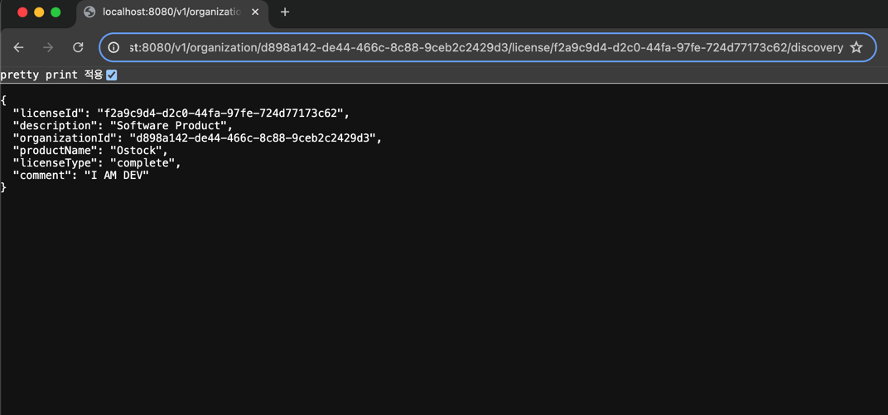
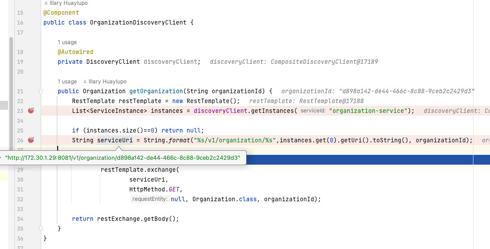

# 6. 서비스 디스커버리
- 분산 아키텍처에서는 `호스트 이름`과 머신이 위치한 `IP주소`를 알야 한다. => **서비스 디스커버리** 개념
- `서비스 디스커버리`는 **두 가지 핵심적인 이유**로 **마이크로서비스**와 **클라우드 기반 애플리케이션**에 매우 중요하다.
  - **수평 확장**
    - 인스턴스 및 컨테이너 추가하는 것을 의미한다.
  - **회복성**
    - 아키텍처와 서비스 내부의 문제로 충격을 흡수하는 능력을 의미한다.

[서비스 디스크버리 사용시 장점]
- **실행 중인 서비스 인스턴스**의 수를 빠르게 **수평 확장**할 수 있다.
  - 서비스 소비자는 인스턴스의 물리적 위치를 알지 못하기 때문에 새 인스턴스는 서비스 풀에서 추가되거나 제거될 수 있다.
- 애플리케이션 **회복성을 향상**시킨다.
  - 서비스 인스턴스가 비정상적이거나 가용하지 못한 상태가 되면 **서비스 디스커버리 엔진은 해당 서비스를 가용 서비스 목록에서 제거**한다.

## 6.1 서비스 위치 확인
[그림 6-1] DNS와 로드밸런서를 사용하는 전통적인 서비스 위치 확인 모델
  
출처 : 길벗 - 스프링 마이크로서비스 코딩 공작소 개정2판  
- [그림 6-1]의 모델은 클라우드 기반의 **마이크로서비스 애플리케이션에서는 어울리지 않는다.**
  - 단일 장애 지점(Single Point of Failure)
  - 수평 확장 능력 제한
    - 하나의 로드 밸런서 클러스터로 들어가게 되면, 이 클러스터가 처리할 수 있는 트래픽 양에 제한
  - 고정적인 관리
    - 전통적인 로드 밸런서는 설정과 관리가 대부분 수동으로 이루어져서, 트래픽 패턴이 변할 때 빠르게 대응하기 어렵다.
    - 예를 들어, 새로운 서버를 추가하거나 특정 서버를 빼야 할 경우, 수동으로 로드 밸런서 설정을 변경
  - 소비자 요청을 물리적 서비스에 매핑
    - 고정된 IP 주소나 고정된 엔드포인트를 사용해야 하므로, 유연한 서비스 이동이나 서비스의 동적 스케일링에 한계

## 6.2 클라우드에서 서비스 디스커버리
- 클라우드 기반 마이크로서비스 환경에서 **해결책**은 다음과 같은 특성을 가진 **서비스 디스커버리**매커니즘을 활용하는 것이다.
- **서비스 디스커버리 특징**
  - **고가용성**
    - `핫 클러스터링` 환경을 지원.(서비스 디스커버리 클러스터간 검색 정보 공유) => 한 노드가 가용불가시, 다른 노드가 대체
  - **P2P**
    - 서비스 디스커버리 클러스터의 모든 노드는 `서비스 인스턴스 상태를 상호 공유`한다.
  - **부하 분산**
    - 요청을 동적으로 분산시켜 모든 인스턴스에 분배 => 고정적이며 수동으로 관리되는 로드 밸런서를 대체
  - **회복성**
    - 서비스 디스커버리 클라이언트는 `서비스 정보를 로컬에 캐싱`해야 한다. => 디스커버리 기능이 저하되는것을 고려, 디스커버리 서버가 죽어도 작동해야함.
  - **결함 내성**
    - 서비스 디스커버리가 비정상 서비스 인스턴스를 탐지하면, 서비스 목록에서 해당 인스턴스를 제거해야한다. => **사람의 개입 없이 조치 되어야함.**

### 6.2.1 서비스 디스커버리 아키텍처
[서비스 디스커버리 아키텍처의 일반적인 개념]
- `서비스 등록`
  - 서비스가 디스커버리 에이전트에 등록하는 방법
- `클라이언트의 서비스 주소 검색`
  - 서비스 클라이언트가 서비스 정보를 검색하는 방법
- `정보 공유`
  - 노드 간 서비스 정보를 공유하는 방법
- `상태 모니터링`
  - 서비스가 서비스 디스커버리에 상태를 전달하는 방법

[그림 6-2] 서비스 인스턴스 추가&제거시 디스커버리에서 발생하는 일련의 과정
  
출처 : 길벗 - 스프링 마이크로서비스 코딩 공작소 개정2판  
- **서비스 인트턴스**는 시작할 때, 검색 인스턴스가 자신을 액세스하는 데 사용할 **위치,경로,포트**를 등록한다. => 동일한 인스턴스 그룹은 하나의 서비스이며, **동일 서비스ID로 등록** 된다.
- 서비스그룹 인스턴스 데이터를 P2P방식으로 서비스 디스커버리 계층에서 공유한다.
- 이러한 방법은, 서비스 디스커버리 엔진에 완전히 의존하게 되므로, **클라이언트 측 로드 밸런싱**을 사용하면, 더욱 견고해 진다.

[클라이언트 측 로드 밸런싱]
- [그림 6-3] 클라이언트 측 로드 밸런싱은 서비스 위치를 캐싱, 서비스 클라이언트가 매 호출마다 서비스 디스커버리에 묻지않음.
  
출처 : 길벗 - 스프링 마이크로서비스 코딩 공작소 개정2판  

### 6.2.2 스프링과 넷플릭스 유레카를 사용한 서비스 디스커버리
- [그림 6-4] O-stock 마이크로서비스를 위해 **유레카를 사용한 클라이언트 측 캐싱**(스프링 클라우드 로드 밸런서 사용)의 구현
     
  출처 : 길벗 - 스프링 마이크로서비스 코딩 공작소 개정2판  
[처리 과정]
1. 서비스 부트스트래핑 시점에 라이선싱 및 조직 서비스는 유레카 서비스에 등록, `서비스의 서비스 ID`와 해당 `서비스 인스턴스의 물리적 위치 및 포트 번호`를 **유레카에 알려** 준다.
2. `스프링 클라우드 로드 밸런서`를 사용하여 **클라이언트 측 로드밸런싱 제공**, 이 로드 밸런서는 유레카 서비스에 접속하여 서비스 위치 정보를 검색하고 **로컬에 캐시**
3. 스프링 클라우드 로드 밸런서는 유레카 서비스를 주기적으로 핑(ping)해서 로컬 캐시의 서비스 위치를 갱신

## 6.3 스프링 유레카 서비스 구축
## 6.4 스프링 유레카에 서비스 등록
### 6.4.1 유레카 REST API
   
   
### 6.4.2 유레카 대시보드
   
## 6.5 서비스 디스커버리를 이용한 서비스 검색
- 서비스 소비자가 `스프링 클라우드 로드 밸런서`와 상호작용할 수 있는 `클라이언트 라이브러리` 3가지(추상화가 낮은 단계 -> 높은단계)
  - 스프링 Discovery Client
  - REST 템플릿을 사용한 스프링 Discovery Client
  - 넷플릭스 Feign 클라이언트
### 6.5.1 스프링 Discovery Client로 서비스 인스턴스 검색
- `DiscoveryClient` 클래스는 스프링 클라우드 로드 밸런서와 상호작용한다.
  - 서비스 인스턴스가 등록되어 있는지 확인하기 위해 로드 밸런서에 쿼리해야 할 때만 사용해야 한다.
> Discovery Client 와 현실
> - 스프링 클라우드 클라이언트 측 로드 밸런서를 이용하지 못한다.
> - 너무 많은 일을 한다.  

  
  

### 6.5.2 로드 밸런서를 지원하는 스프링 REST 템플릿으로 서비스 호출
    
  
  
- 로드밸런서를 지원하는 RestTemplate 클래스(@LoadBalanced 어노테이션)
  - `스프링 클라우드 로드 밸런서`가 인스턴스에 대한 모든 요청을 `라운드 로빈 방식`으로 부하 분산한다.
### 6.5.3 넷플릭스 Feign 클라이언트로 서비스 호출
  
    

## 6.6 요약
- 서비스 디스커버리 패턴을 사용하여 서비스 위치를 추상화한다.
- 클라이언트 측 로드 밸런싱을 사용하면 서비스의 물리적 위치를 캐싱하여 더 높은 성능 및 회복성을 제공할 수 있다.
