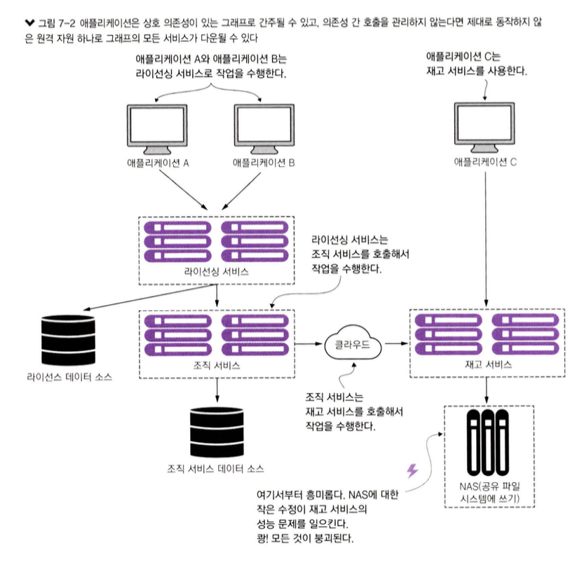

# 7. 나쁜 상황에 대비한 스프링 클라우드와 Resilience4j 를 사용한 회복성 패턴
- 모든 시스템, 특히 분산 시스템은 실패를 겪는다. => 실패에 대응하는 애플리케이션 구축방법은 중요하다.
- 보통 회복성을 갖춘 시스템을 구축할 때, `인프라스트럭처`나 `중요 서비스의 한 부분이 실패한 경우`만 고려한다. => 회복력 있는 시스템 구축에 있어 작은 한 부분에 문제만 해결할 뿐이다.
- 서비스가 망가지면 쉽게 우회할 수 있지만, **서비스가 느려진다면 성능 저하를 감지하고 우회하는 일은 매우 어렵다.**
  - **서비스 성능 저하**는 간헐적으로 시작되어 **확산**될 수 있다.
    - 애플리케이션 컨테이너 스레드 풀 소진 등..
  - 원격 서비스 호출은 대개 **동기식**이며 장기간 수행되는 호출을 중단하지 않는다.
    - 호출자에게는 서비스 호출이 행되는 것을 방지하는 타임아웃 개념이 없다. => 설정을 통해 극복
  - 대개 원격 자원의 부분적인 저하가 아닌 **완전한 실패를 처리하도록 애플리케이션을 설계**한다.
    - 계속해서 불량한 서비스를 호출하고 빠르게 실패하지 못하는 경우가 많다. => 자원고갈(스레드 풀, 컨네션 풀) 로 고장 날 가능성이 더 높다.
- 보호장치가 없다면 불량한 서비스 하나가 빠르게 **여러 애플리케이션을 다운**시킬 수 있다.
- **회복성 패턴**은 MSA에서 가장 중요한 요소 중 하나이다.

## 7.1 클라이언트 측 회복성이란?
- `클라이언트 측 회복성`이란 `에러나 성능 저하로 원격 자원이 실패`할 때 **클라이언트가 고장 나지 않게 보호하는 데 초점**을 둔다.
  - 빨리 실패하여, 자원고갈을 방지 할 수 있다.
[그림 7-1] 네 가지 클라이언트 회복성 패턴, **서비스 소비자 및 소비자 사이에서 보호대 역할**
  
출처 : 길벗 - 스프링 마이크로서비스 코딩 공작소 개정2판  

### 7.1.1 클라이언트 측 로드 밸런싱
- `클라이언트 측 로드 밸런싱`은 디스커버리 에이전트(ex,유레카)에서 서비스 인스턴스를 검색후, 해당 인스턴스들의 물리적 위치를 캐싱하는 작업을 의미한다.
- `클라이언트 측 로드 밸런서`는 서비스 클라이언트와 소비자 사이에 위치하여, 특정 인스턴스에 문제 발생시 탐지할 수 있다.
- `클라이언트 측 로드 밸런서`가 문제를 탐지하면 문제된 서비스 인스턴스를 제거하여, 해당 인스턴스를 더 이상 호출하지 않게 된다.
### 7.1.2 회로 차단기
- `소프트웨어 회로 차단기`는 **원격 서비스 호출**될 때 **호출을 모니터링**한다.
- 호출이 너무 오래 걸리면, 차단기가 개입해서 호출을 종료한다.
### 7.1.3 폴백 처리
- `폴백 패턴`을 사용하면, 서비스 **호출 실패시 예외를 생성하지 않고** 대체코드 경로를 실행하여 **다른 수단을 통해 작업을 수행**한다.
  - ex) 다른 데이터 소스에서 데이터를 찾거나, 요청을 큐에 입력 
### 7.1.4 벌크헤드
- `벌크헤드 패턴`을 사용할 때 원격 자원에 대한 호출을 스레드 풀로 분리하면, 전체 애플리케이션을 다운시킬 위험을 줄일 수 있다.
  - 스레드 풀별로 서비스를 할당하면 다른 서비스는 포화되지 않기 때문에 병목 현상을 우회할 수 있다.

## 7.2 클라이언트 회복성이 중요한 이유
[그림 7-2] 회복성 패턴 미적용  
  
출처 : 길벗 - 스프링 마이크로서비스 코딩 공작소 개정2판    
- 회복성 패턴이 적용되지 않았을 경우, 한 개의 고장난 서비스로 인해 어떻게 전체 아키텍처가 다운 되는지를 보여 준다.
  - NAS 시스템 문제 발생(재고 서비스)
  - 라이선싱 서비스 -> 조직 서비스 -> 재고 서비스 순으로 호출
    - `라이선싱 서비스`는 `재고 서비스`로 느려진 `조직 서비스`를 호출하기 때문에 자원 부족 시작 => 회로 차단기 패턴이 있었다면, 이러한 문제를 사전 방지 가능.  

[그림 7-3] 회복성 패턴 적용  
  
출처 : 길벗 - 스프링 마이크로서비스 코딩 공작소 개정2판  
- `정상 경로`
  - 회로 차단기는 타이머를 설정, 타이머 만료전 원격 호출이 완료되면 정상 수행
- `폴백 없는 회로 차단기`
  - 조직 서비스가 느리게 실행되어, **스레드 타이머가 만료**되기 전 호출 미완료시 **조직서비스에 대한 연결을 종료** 
  - 발생한 실패 횟수를 추적하고, **필요 이상으로 오류 발생시 회로를 차단**하고 모든 **조직서비스 호출을 실패**가 되게 한다.
- `폴백 있는 회로 차단기`
  - 실패시, 대체 코드를 사용하여 조치한다.
  - 회로 차단기에서 연속적으로 성공하게되면 회로 차단기를 다시 열고, 조직서비스와 통신을 진행한다.

[회로 차단기 패턴의 주요 이점]
- `빠른 실패`
  - 원격 서비스 성능 저하시, 빠르게 실패하고 자원 고갈 이슈를 방지.
- `원만한 실패`
  - 대체 메커니즘을 제공할 수 있게 해준다. => 폴백
- `원활한 회복`
  - 사람의 개입 없이 자원데 대한 재접근을 허용하도록 해준다.

## 7.3 Resilience4j 구현
- Resilience4j는 내결함성 라이브러리다. **결함 내성을 높이기 위해 다음 패턴을 제공**
  - `회로 차단기`
    - 서비스 실패시, 요청을 중단한다.
  - `재시도`
    - 서비스 실패시, 재시도 한다.
  - `벌크헤드`
    - 과부하를 피하고자 서비스 요청 수를 제한한다.
  - `속도 제한`
    - 서비스가 한 번에 수신하는 호출 수를 제한한다.(초당 100개 요청과 같이 요청의 수에 제한)
  - `폴백`
    - 실패요청에 대해 대체 경로를 설정한다.

> Resilience4j가 적용되는 순서
> - Retry(CircuitBreaker(RateLimiter(TimeLimiter(Bulkhead(Function)))))
> - RateLimiter : 요청 수를 제한
> - TimeLimiter : 작업 시간(타임아웃)을 제한

## 7.4 스프링 클라우드와 Resilience4j를 사용하는 라이선싱 서비스 설정
````xml
<dependency>
    <groupId>io.github.resilience4j</groupId>
    <artifactId>resilience4j-spring-boot2</artifactId>
    <version>${resilience4j.version}</version>
</dependency>
<dependency>
    <groupId>io.github.resilience4j</groupId>
    <artifactId>resilience4j-circuitbreaker</artifactId>
    <version>${resilience4j.version}</version>
</dependency>
<dependency>
    <groupId>io.github.resilience4j</groupId>
    <artifactId>resilience4j-timelimiter</artifactId>
    <version>${resilience4j.version}</version>
</dependency>
 <dependency>
    <groupId>org.springframework.boot</groupId>
    <artifactId>spring-boot-starter-aop</artifactId>
</dependency>
````
## 7.5 회로 차단기 구현
- 회로 차단기가 추구하는 것은 **원격 호출을 모니터링**하고 **서비스를 장기간 기다리지 않게 하는 것**
  
출처 : 길벗 - 스프링 마이크로서비스 코딩 공작소 개정2판  
  
출처 : 길벗 - 스프링 마이크로서비스 코딩 공작소 개정2판  
- 최초 링버퍼 12개는 채운 이후에, 회로 차단기 기능이 실행된다.(최초 11번 실패해도, 회로차단기는 작동하지 않음.)
- 요청 성공시 0, 실패시 1로 링버퍼를 채운다.
- 회로 차단기가 열린 상태라면 설정된 시간 동안 호출은 거부되며, `CallNotPermittedException` **예외**를 발생시킨다.
  - 설정 시간이 만료되면, 회로 차단기는 `반열린 상태로 변경`된다.
  - `반열린 상태`에서 **실패율을 평가**한다.

[그림 7-6] 구현할 내용  
  
출처 : 길벗 - 스프링 마이크로서비스 코딩 공작소 개정2판  

[그림 7-7] 라이선싱 서비스 회로 차단기 열린 상태  
  
출처 : 길벗 - 스프링 마이크로서비스 코딩 공작소 개정2판      
````
http://localhost:8080/v1/organization/e6a625cc1718b-48c2-ac76-1dfdff9a531e/license/
````
### 7.5.1 조직 서비스에 회로 차단기 추가 
    
출처 : 길벗 - 스프링 마이크로서비스 코딩 공작소 개정2판  
  
출처 : 길벗 - 스프링 마이크로서비스 코딩 공작소 개정2판  

### 7.5.2 회로 차단기 사용자 정의
````yaml
resilience4j.circuitbreaker:
  instances:
    licenseService: #라이선싱 서비스의 인스턴스 구성(회로 차단기 애너테이션 이름과 동일)
      registerHealthIndicator: true #상태 정보 엔드포인트 구성 정보 노출여부
      ringBufferSizeInClosedState: 5  # 링 버퍼의 닫힌 크기 설정(최근 5개의 요청을 추적)
      ringBufferSizeInHalfOpenState: 3  # 링 버퍼의 반열린 상태 크기 설정(Half-Open 상태에서 테스트할 요청 수)
      waitDurationInOpenState: 10s  # 열린 상태의 대기시간 설정(기본 60초)
      failureRateThreshold: 50  # 실패율 임계치
      recordExceptions: # 실패로 기록될 예외 설정
        - org.springframework.web.client.HttpServerErrorException
        - java.io.IOException
        - java.util.concurrent.TimeoutException
        - org.springframework.web.client.ResourceAccessException
    organizationService:  # 조직 서비스 인스턴스 구성
      registerHealthIndicator: true
      ringBufferSizeInClosedState: 6
      ringBufferSizeInHalfOpenState: 4
      waitDurationInOpenState: 20s
      failureRateThreshold: 60
````
## 7.6 폴백 처리
- 서비스 실패를 가로채서 다른 대앙은 취할 수 있다. => 폴백 전략이라 부름.
- 
## 7.7 벌크헤드 패턴 구현
## 7.8 재시도 패턴 구현
## 7.9 속도 제한기 패턴구현
## 7.10 ThreadLocal과 Resilience4
## 7.11 요약


  
출처 : 길벗 - 스프링 마이크로서비스 코딩 공작소 개정2판  