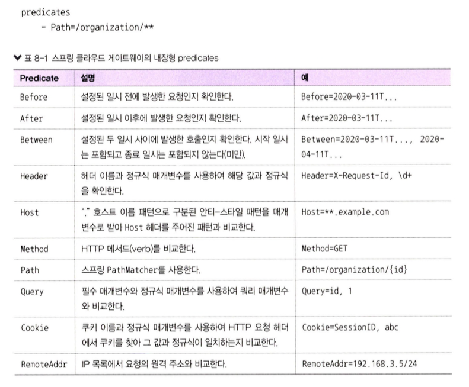
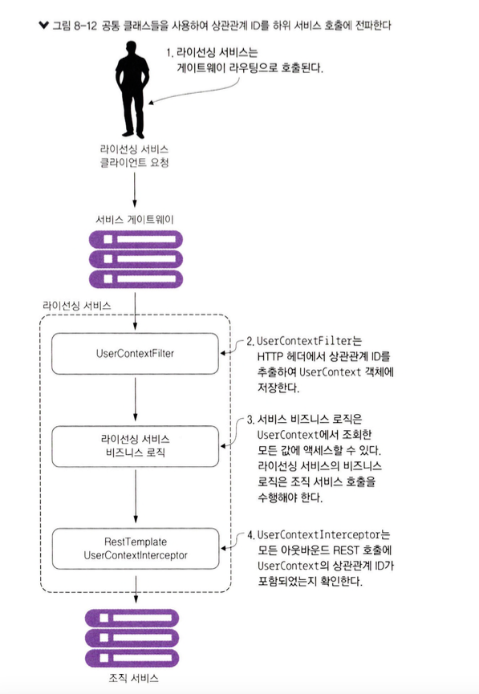
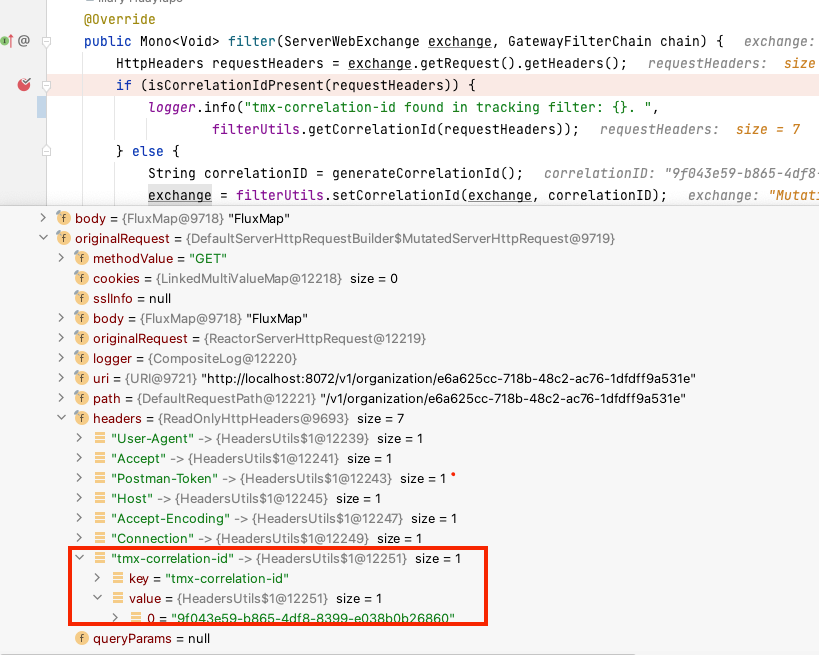
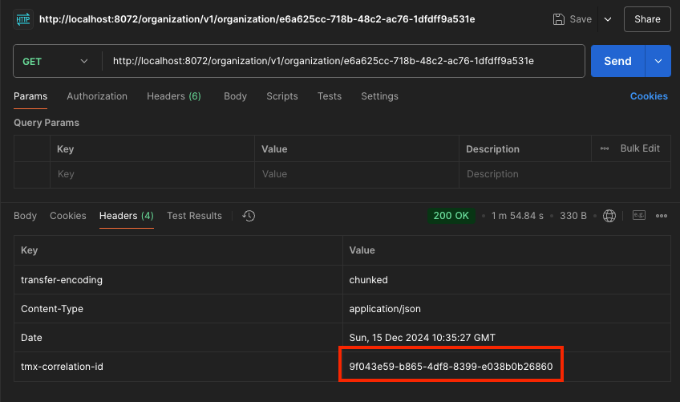
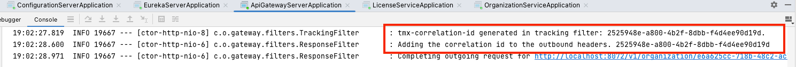
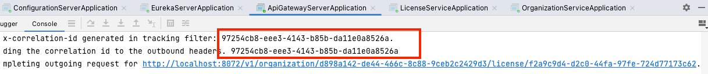
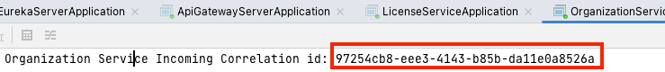

# 8. 스프링 클라우드 게이트웨이를 이용한 서비스 라우팅
- **분산형 아키텍처**에서는 `보안과 로깅, 여러 서비스 호출에 걸친 사용자 추적`과 같은 작업을 해야한다.
- 공통 라이브러리 & 프레임워크를 사용해서 직접할 수 있지만, `부작용`을 유발할 수 있다.
  - 각 서비스에 일관되게 구현되기 어렵다.
  - 보안 & 로깅과 같은 `횡단 관심사`의 구현 책임을 개별 개발 팀에 전가하면 **잘못 구현**하거나 **누락**할 수 있다.
  - **모든 서비스에 걸쳐 강한 의존성을 만들 수 있다.**
- **게이트 웨이**
  - 위 문제를 해결하기 위해 **횡단 관심사를 독립적으로 배치**, **모든 마이크로서비스 호출에 대한 필터 & 라우터 역할을 할 수 있는 서비스로 추상화 필요**하다.
  - `게이트 웨이`를 통해 문제를 해결 할 수 있다.
  - `서비스 클라이언트`는 **마이크로서비스를 직접 호출하지 않는다.**
  - `모든 호출`은 **단일 정책 시행 지점(PEP, Policy Enforcement Point)** 역할을 하는 `서비스 게이트웨이를 경유`한 다음 **최종 목적지로 라우팅** 된다.     

**[이장에서 살펴볼 내용]**
- `하나의 URL 뒤에 모든 서비스를 배치`하고 **서비스 디스커버리를 사용**하여 해당 호출을 **실제 서비스 인스턴스에 매핑**하는 방법
- 서비스 게이트웨이를 경유하는 **모든 서비스 호출에 상관관계 ID를 삽입**하는 방법
- **HTTP 응답에 전달받은 상관관계 ID를 삽입하여 클라이언트로 재전송**하는 방법

## 8.1 서비스 게이트웨이란?
- `서비스 게이트웨이`는 애플리케이션 내 마이크로서비스를 호출하기 위해 유입되는 **모든 트래픽의 게이트키퍼**의 **역할**을 한다.
- `서비스 게이트웨이`에서 구현할 수 있는 **횡단 관심사**
  - **정적 라우팅**
    - 서비스 게이트웨이는 `단일 서비스 URL`과 `API 경로`로 **모든 서비스를 호출**
  - **동적 라우팅**
    - 요청 데이터를 기반으로 서비스 호출자를 위한 `지능적 라우팅`을 수행
    - ex) 베타 프로그램에 참여하는 고객의 서비스 호출은 사람들이 사용하는 버전과 다른 버전의 코드가 실행되는 특정 서비스 클러스터로 라우팅
  - **인증과 인가**
    - 모든 서비스 호줄이 서비스 게이트웨이로 라우팅, 서비스 호출자가 자신의 인증 여부를 확인할 수 있는 적합한 장소
  - **지표 수집과 로깅**
    -  서비스 호출이 게이트웨이를 통과하기 때문에, 서비스 게이트웨이를 지표와 로그를 수집하는 데 사용

**[서비스 게이트웨이 사용 전]**   
   
출처 : 길벗 - 스프링 마이크로서비스 코딩 공작소 개정2판    

**[서비스 게이트웨이 사용 후]**  
   
출처 : 길벗 - 스프링 마이크로서비스 코딩 공작소 개정2판  

> **잠깐! 서비스 게이트웨이가 단일 장애 지점이나 잠재적 병목 지점은 아닐까?**
> - 서비스 게이트웨이도 올바르게 구현되지 않는다면 **단일 장애&병목 지점이 될 수 있음.**
> - `로드밸런서`는 **여러 서비스 게이트웨이 인스턴스앞**에 두는 것은 적절한 설계
>   - 필요할 때 서비스 게이트웨이를 확장하기 용이하다.
> - **서비스 게이트웨이를 무상태(stateless)로 작성하라**
>   - 어떠한 정보도 서비스게이트웨이의 메모리에 저장하면 안된다. 확장성을 제한할 수 있다.
> - **서비스 게이트웨이를 가볍게 유지하라**
>   - 서비스 게이트웨이는 병목지점이 될 수 있다.

## 8.2 스프링 클라우드 게이트웨이 소개
- `스프링 클라우드 게이트웨이`는 스프링 5, 리액터, 스프링 부트 2.0을 기반 기반으로 한 **API 게이트웨이 구현체** => 논블로킹 형태
- `스프링 클라우드 게이트웨이`는 다음 기능들을 제공
  - 애플리케이션의 모든 서비스 경로를 **단일 URL에 매핑**
  - 게이트웨이로 유입되는 **요청과 응답을 검사**하고 **조치를 취할 수 있는 필터를 작성**
  - 요청을 실행하거나 처리하기 전에 **해당 요청이 주어진 조건을 충족하는지 확인**할 수 있는 서술자를 만든다

### 8.2.1 스프링 부트 게이트웨이 프로젝트 설정
````xml
<dependency>
    <groupId>org.springframework.cloud</groupId>
    <artifactId>spring-cloud-starter-gateway</artifactId>
</dependency>
````

````yaml
spring:
    application:
      name: gateway-server 
    cloud:
      config: 
        uri: http://localhost:8071 # 유레카 서버와 연동
````

### 8.2.2 유레카와 통신하는 스프링 클라우드 게이트웨이 구성
- 스프링 컨피그 서버에 유레카 구성 정보 설정
````yaml
server:
  port: 8072
 
eureka:
  instance:
    preferIpAddress: true
  client:
    registerWithEureka: true
    fetchRegistry: true
    serviceUrl:
      defaultZone: http://localhost:8070/eureka/
````
````java
@SpringBootApplication
@EnableEurekaClient //게이트웨이 서버, 유레카 클라이언트 설정
public class ApiGatewayServerApplication {

	public static void main(String[] args) {
		SpringApplication.run(ApiGatewayServerApplication.class, args);
	}
}
````
## 8.3 스프링 클라우드 게이트웨이에서 라우팅 구성
- `스프링 클라우드 게이트웨이`는 본래 **리버스 프록시**다.
  - 리버스 프록시 : 자원에 도달하려는 클라이언트와 자원 사이에 위치한 중개 서버
- 상위 서비스와 통신하려면 `게이트웨이`는 **유입된 호출이 상위 경로에 매핑하는 방법을 알아야** 한다.
- 스프링 클라우드 게이트웨이에서 제공하는 매커니즘
  - `서비스 디스커버리를 이용한 자동 경로 매핑`
  - `서비스 디스커버리를 이용한 수동 경로 매핑`
### 8.3.1 서비스 디스커버리를 이용한 자동 경로 매핑
````yaml
spring:
  cloud:
    gateway:
      discovery.locator:  # 서비스 디스커버리에 등록된 서비스를, 게이트웨이가 경로를 생성하도록 설정
        enabled: true
        lowerCaseServiceId: true
````
   
출처 : 길벗 - 스프링 마이크로서비스 코딩 공작소 개정2판  
  
출처 : 길벗 - 스프링 마이크로서비스 코딩 공작소 개정2판    
  
출처 : 길벗 - 스프링 마이크로서비스 코딩 공작소 개정2판    

### 8.3.2 서비스 디스커버리를 이용한 수동 경로 매핑
````yaml
spring:
  cloud:
    loadbalancer.ribbon.enabled: false
    gateway:
      discovery.locator:
        enabled: true
        lowerCaseServiceId: true
      routes:
      - id: organization-service
        uri: lb://organization-service
        predicates:
        - Path=/organization/**
        filters:
        - RewritePath=/organization/(?<path>.*), /$\{path}
````
   
출처 : 길벗 - 스프링 마이크로서비스 코딩 공작소 개정2판  
     
출처 : 길벗 - 스프링 마이크로서비스 코딩 공작소 개정2판  
### 8.3.3 동적으로 라우팅 구성을 재로딩
- 게이트웨이 서버의 재시작 없이 경로 매핑을 변경할 수 있기 때문에 유용하다.
- 깃이나 외부 설정을 변경후, `POST : http://localhost:8072/actuator/gateway/refresh` 요청하면 가능하다.
## 8.4 스프링 클라우드 게이트웨이의 진정한 능력: Predicate과 Filter Factories
- 스프링 클라우드 게이트웨이를 통하는 모든 `서비스 호출에 적용될 사용자 정의 로직을 작성`할 때 발휘된다.
- 스프링 클라우드 게이트웨이 `Predicate`과 `Filter Factories`는 **스프링 관점 클래스**와 유사하게 사용할 수 있다.
       
출처 : 길벗 - 스프링 마이크로서비스 코딩 공작소 개정2판   

### 8.4.1 게이트웨이 Predicate Factories
- `게이트웨이의 서술자`는 요청을 실행하거나 처리하기 전에 `요청이 조건 집합을 충족 하는지 확인하는 객체`
         
출처 : 길벗 - 스프링 마이크로서비스 코딩 공작소 개정2판  

### 8.4.2 게이트웨이 Filter Factories
- 모든 서비스 호출에 대해 `일관된 방식으로 작업을 수행` 즉, 이러한 필터로 수신 및 발신하는 HTTP 요청과 응답을 수정할 수 있다
           
출처 : 길벗 - 스프링 마이크로서비스 코딩 공작소 개정2판  

### 8.4.3 사용자 정의 필터
- 스프링 클라우드 게이트웨이 내에서 필터를 사용하여 사용자 정의 로직을 만들 수 있다.
- 스프링 클라우드 게이트웨이는 다음 두 가지 종류의 필터를 지원
  - `사전 필터` : 실제 요청이 목적지로 전송되기 전에 사전 필터가 호출
  - `사후 필터` : 대상 서비스 호출 이후 사전 필터가 호출
             
출처 : 길벗 - 스프링 마이크로서비스 코딩 공작소 개정2판  

[필터 구현 예시]
             
출처 : 길벗 - 스프링 마이크로서비스 코딩 공작소 개정2판  

## 8.5 사전 필터 만들기
- 게이트웨이로 유입되는 모든 요청을 검사
  - 요청에서 `tmx-correlation-id`라는 `HTTP 헤더의 포함 여부를 확인`하는 TrackingFilter라는 사전 필터생성
  - `tmx-correlation-id`는 헤더에는 여러 마이크로 서비스를 거쳐 사용자 요청을 추적하는 데 사용되는 고유한 `GUID`가 포함된다.
- 스프링 클라우드 게이트웨이에서 `글로벌 필터를 생성`하려면 **GlobalFilter 클래스를 구현한 후 filter() 메서드를 재정의**
````java
@Component
public class TrackingFilter implements GlobalFilter {
  ...
  
  @Override
  public Mono<Void> filter(ServerWebExchange exchange, GatewayFilterChain chain) {
    HttpHeaders requestHeaders = exchange.getRequest().getHeaders();
    if (isCorrelationIdPresent(requestHeaders)) {
      logger.debug("tmx-correlation-id found in tracking filter: {}. ",
              filterUtils.getCorrelationId(requestHeaders));
    } else {
      String correlationID = generateCorrelationId();
      exchange = filterUtils.setCorrelationId(exchange, correlationID);
      logger.debug("tmx-correlation-id generated in tracking filter: {}.", correlationID);
    }

    return chain.filter(exchange);
  }
}
````

## 8.6 서비스에서 상관관계 ID 사용
[공통 클래스들을 사용하여 상관관계 ID를 하위 서비스 호줄에 전파]  
             
출처 : 길벗 - 스프링 마이크로서비스 코딩 공작소 개정2판  

- **UserContextFilter**
  - HTTP 헤더에서 상관관계 ID를 추출하여 `UserContext 객체에 저장`
- **UserContext**
  - 서비스 비즈니스 로직은 UserContext에서 조회한 `모든 값에 액세스`
- **UserContext Interceptor**
  - 모든 아웃바운드 REST 호출에 `UserContext의 상관관계 ID가 포함되었는지 확인`

> **중복된 코드 VS. 공유 라이브러리**
> - 마이크로서비스 순수주의자들은 서비스 전반에 걸쳐 사용자 정의 프레임워크를 사용 하면 인위적으로 종속되기 때문에 사용하면 안 된다고 주장
> - 마이크로서비스 실무자들은 공유 라이브러리 를 만들어 서비스 간 공유해야 하는 특정 상황(UserContextFilter 예와 같은)이 존재하기 때문에 순수주의 자들의 접근 방식은 실용적이지 않다고 반론

### 8.6.1 유입되는 HTTP 요청을 가로채는 UserContextFilter
- 서비스로 들어오는 모든 HTTP 요청을 가로채고, **HTTP 요청에서 사용자 컨텍스트 클래스로 상관관계 ID를 매핑하는 HTTP 서블릿 필터**
````java
@Component
public class UserContextFilter implements Filter {
  
    @Override
    public void doFilter(ServletRequest servletRequest, ServletResponse servletResponse, FilterChain filterChain) throws IOException, ServletException {
        HttpServletRequest httpServletRequest = (HttpServletRequest) servletRequest;
        //헤더에서상관계ID를정의, UserContext에 값을 설정
        UserContextHolder.getContext().setCorrelationId(  httpServletRequest.getHeader(UserContext.CORRELATION_ID) );
        UserContextHolder.getContext().setUserId(httpServletRequest.getHeader(UserContext.USER_ID));
        UserContextHolder.getContext().setAuthToken(httpServletRequest.getHeader(UserContext.AUTH_TOKEN));
        UserContextHolder.getContext().setOrganizationId(httpServletRequest.getHeader(UserContext.ORGANIZATION_ID));

        logger.debug("UserContextFilter Correlation id: {}", UserContextHolder.getContext().getCorrelationId());

        filterChain.doFilter(httpServletRequest, servletResponse);
    }
}
````
### 8.6.2 서비스에 쉽게 액세스할 수 있는 HTTP 헤더를 만드는 UserContext
- `UserContext 클래스`는 마이크로서비스가 처리하는 **각 서비스 클라이언트 요청의 HTTP 헤더 값 을 보관**

````java
@Component
public class UserContext {
  public static final String CORRELATION_ID = "tmx-correlation-id";
  public static final String AUTH_TOKEN = "tmx-auth-token";
  public static final String USER_ID = "tmx-user-id";
  public static final String ORGANIZATION_ID = "tmx-organization-id";
  ...
}

//사용자 요청을 처리하는 해당 스 레드에서 호출하는 모든 메서드에 접근 가능한 ThreadLocal 변수에 UserContext를 저장
public class UserContextHolder {
    private static final ThreadLocal<UserContext> userContext = new ThreadLocal<UserContext>();

    public static final UserContext getContext(){
        UserContext context = userContext.get();
        if (context == null) {
            context = createEmptyContext();
            userContext.set(context);

        }
        return userContext.get();
    }

    public static final UserContext createEmptyContext(){
        return new UserContext();
    }
}
````
### 8.6.3 상관관계 ID 전파를 위한 사용자 정의 RestTemplate과 UserContextInterceptor
- UserContextInterceptor 클래스는 `모든 HTTP 기반 서비스 발신 요청에 상관관계 ID를 주입`
````java
public class UserContextInterceptor implements ClientHttpRequestInterceptor {
    private static final Logger logger = LoggerFactory.getLogger(UserContextInterceptor.class);
    @Override
    public ClientHttpResponse intercept(
            HttpRequest request, byte[] body, ClientHttpRequestExecution execution)
            throws IOException {

        HttpHeaders headers = request.getHeaders();
        headers.add(UserContext.CORRELATION_ID, UserContextHolder.getContext().getCorrelationId());
        headers.add(UserContext.AUTH_TOKEN, UserContextHolder.getContext().getAuthToken());

        return execution.execute(request, body);
    }
}

public class LicenseServiceApplication {
  @LoadBalanced
  @Bean
  public RestTemplate getRestTemplate(){
    RestTemplate template = new RestTemplate();
    List interceptors = template.getInterceptors();
    if (interceptors==null){
      //resttemplate에 등록
      template.setInterceptors(Collections.singletonList(new UserContextInterceptor()));
    }
    else{
      interceptors.add(new UserContextInterceptor());
      template.setInterceptors(interceptors);
    }

    return template;
  }
}
````
## 8.7 상관관계 ID를 수신하는 사후 필터 작성
````java
@Configuration
public class ResponseFilter {
 
    final Logger logger =LoggerFactory.getLogger(ResponseFilter.class);
    
    @Autowired
	FilterUtils filterUtils;
 
    @Bean
    public GlobalFilter postGlobalFilter() {
        return (exchange, chain) -> {
            return chain.filter(exchange).then(Mono.fromRunnable(() -> {
            	  HttpHeaders requestHeaders = exchange.getRequest().getHeaders();
            	  String correlationId = filterUtils.getCorrelationId(requestHeaders);
            	  logger.info("Adding the correlation id to the outbound headers. {}", correlationId);
                  exchange.getResponse().getHeaders().add(FilterUtils.CORRELATION_ID, correlationId);
                  logger.info("Completing outgoing request for {}.", exchange.getRequest().getURI());
              }));
        };
    }
}
````
             
출처 : 길벗 - 스프링 마이크로서비스 코딩 공작소 개정2판  
             
출처 : 길벗 - 스프링 마이크로서비스 코딩 공작소 개정2판  
             
출처 : 길벗 - 스프링 마이크로서비스 코딩 공작소 개정2판  


[게이트웨이 -> 라이센스 -> 조직]
             
출처 : 길벗 - 스프링 마이크로서비스 코딩 공작소 개정2판    
             
출처 : 길벗 - 스프링 마이크로서비스 코딩 공작소 개정2판    
               
출처 : 길벗 - 스프링 마이크로서비스 코딩 공작소 개정2판   
## 8.8 요약
