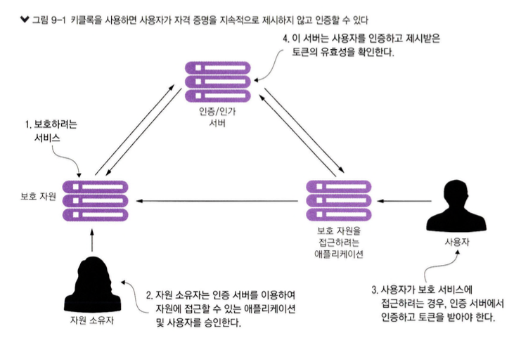
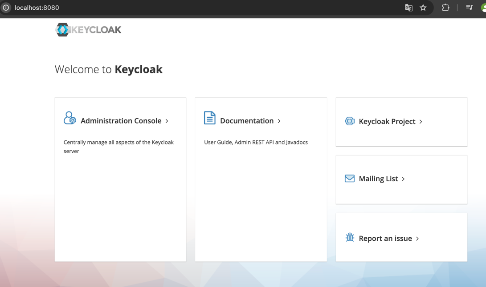
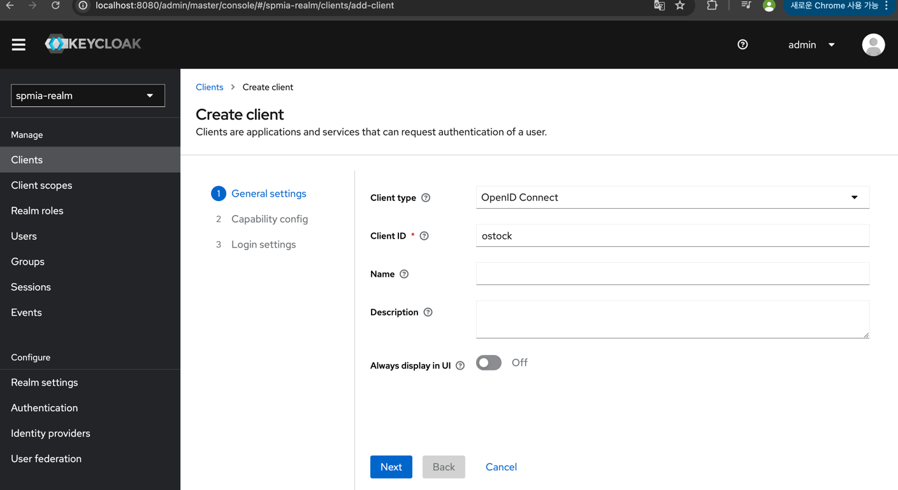
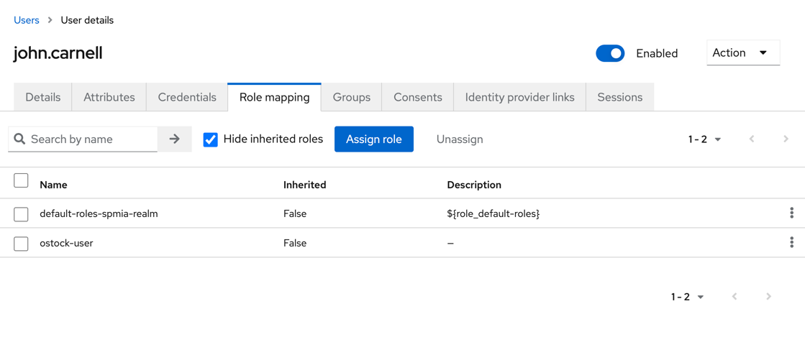
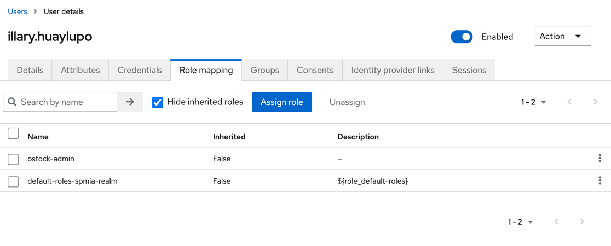
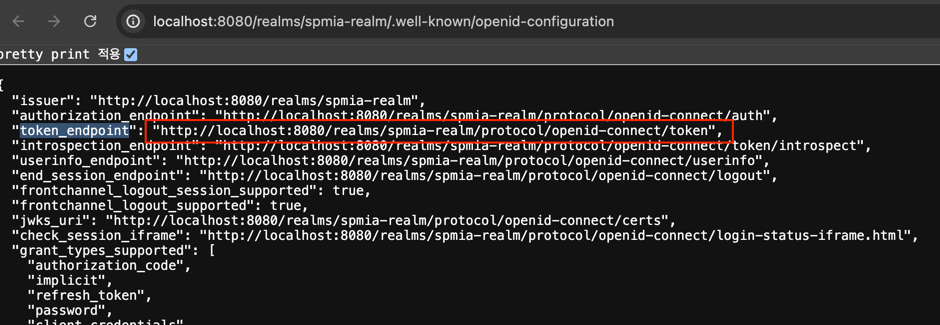
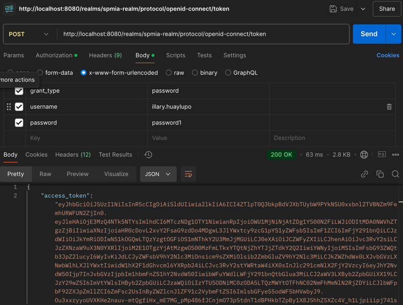
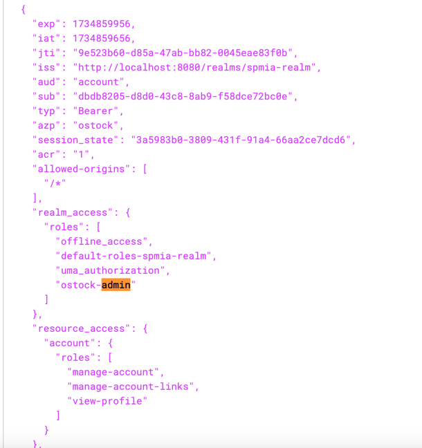

# 9. 마이크로서비스 보안
- 마이크로서비스 아키텍처를 갖게 되면서 `보안 취약점`을 **막는 작업은 중요**해진다.
- 마이크로서비스 아키텍처 보안 계층
  - `애플리케이션 계층`
    - 작업의 수행 권한이 있는지 확인
  - `인프라스트럭처`
    - 서비스를 항상 실행하고 패치하고 최신화
  - `네트워크 계층`
    - 서비스가 명확히 정의된 포트를 통해 인가된 소수의 서버에만 접근

> 공개된 취약점을 찾아내는 **OWASP**

- 스프링 기반의 서비스 보안
  - **스프링 클라우드 시큐리티**
  - **키클록**(ID 및 액세스 관리)

## 9.1 OAuth2소개
- 사용자는 `ID 제공자` 라고 하는 `제삼자 인증 서비스`로 **자신을 인증**
- 사용자는 인증에 성공하면 모든 요청과 함께 전달할 토큰을 제공받고 인증 서비스에 이 **토큰의 유효성을 확인**
- 요청을 처리하는 모든 서비스에 자격 증명을 제시하지 않고도 **각 서비스에서 사용자를 인증**
- OAuth2 명세에는 네 가지 그랜트 타입
  - 패스워드
  - 클라이언트 자격 증명
  - 인가 코드
  - 암시적
- OAuth2의 진정한 강점
  - 애플리케이션 개발자가 제삼자 ID 제공자와 쉽게 통합
  - 자격증명을 제삼자 서비스에 계속 전달하지 않고도 해당 서비스에서 사용자를 인증하고 인가

## 9.2 키클록 소개
- 키클록
  - `서비스`와 `애플리케이션`을 위한 **ID 및 액세스 관리용** 오픈 소스 솔루션
- **키클록의 주요 특징**
  - 인증을 중앙 집중화, `SSO 인증`을 가능하게 한다.
  - 보안 측면에 대해 걱정하기보다는 비즈니스 기능에 집중
  - 2단계 인증 가능
  - LDAP와 호환
  - 애플리케이션과 서버를 쉽게 보호할 수 있는 여러 어댑터를 제공
  - 패스워드 정책을 재정의


               
출처 : 길벗 - 스프링 마이크로서비스 코딩 공작소 개정2판  

[키클록 보안]
- 보호 자원
- 자원 소유자
- 애플리케이션
- 인증 및 인가 서버

> **인증과 인가**
> - 인증 : 자격 증명을 제시하여 사용자가 누구인지 증명하는 행위
> - 인가 : 인가(권한 부여)는 사용자가 원하는 작업을 수행할 수 있는지 여부를 결정

## 9.3 작게 시작하기: 스프링과 키클록으로 한 개의 엔드포인트 보호
````shell
docker run --name keycloak \
-p 8080:8080 \
-e KEYCLOAK_ADMIN=admin \
-e KEYCLOAK_ADMIN_PASSWORD=admin \
quay.io/keycloak/keycloak:23.0.1 \
start-dev
````
### 9.3.1 도커에 키클록 추가하기
### 9.3.2 키클록 설정
   
- `realm`은 키클록이 사용자, 자격 증명, 역할(role), 그룹을 한데 묶어서 관리하는 저장소
### 9.3.3 클라이언트 애플리케이션 등록
               
출처 : 길벗 - 스프링 마이크로서비스 코딩 공작소 개정2판  
### 9.3.4 O-stock 사용자 구성
  
  
````
http://localhost:8080/realms/spmia-realm/.well-known/openid-configuration
````
### 9.3.5 O-stock 사용자 인증
  
````
http://localhost:8080/realms/spmia-realm/protocol/openid-connect/token
````
  
- grant_type : 실행항 그랜트 타입
- username : 로그인 사용자 이름
- password : 로그인하는 사용자 비밀번호
````
{
    "access_token": "eyJhbGciOiJSUzI1NiIsInR5cCIgOiAiSldUIiwia2lkIiA6ICI4ZTlpT0Q3bkpBdVJXbTUybW9PYkNSU0xxbnl2TVBNZm9FemhURWFUN2ZjIn0.eyJleHAiOjE3MzQ4NTk5NTYsImlhdCI6MTczNDg1OTY1NiwianRpIjoiOWU1MjNiNjAtZDg1YS00N2FiLWJiODItMDA0NWVhZTgzZjBiIiwiaXNzIjoiaHR0cDovL2xvY2FsaG9zdDo4MDgwL3JlYWxtcy9zcG1pYS1yZWFsbSIsImF1ZCI6ImFjY291bnQiLCJzdWIiOiJkYmRiODIwNS1kOGQwLTQzYzgtOGFiOS1mNThkY2U3MmJjMGUiLCJ0eXAiOiJCZWFyZXIiLCJhenAiOiJvc3RvY2siLCJzZXNzaW9uX3N0YXRlIjoiM2E1OTgzYjAtMzgwOS00MzFmLTkxYTQtNjZhYTJjZTdkY2Q2IiwiYWNyIjoiMSIsImFsbG93ZWQtb3JpZ2lucyI6WyIvKiJdLCJyZWFsbV9hY2Nlc3MiOnsicm9sZXMiOlsib2ZmbGluZV9hY2Nlc3MiLCJkZWZhdWx0LXJvbGVzLXNwbWlhLXJlYWxtIiwidW1hX2F1dGhvcml6YXRpb24iLCJvc3RvY2stYWRtaW4iXX0sInJlc291cmNlX2FjY2VzcyI6eyJhY2NvdW50Ijp7InJvbGVzIjpbIm1hbmFnZS1hY2NvdW50IiwibWFuYWdlLWFjY291bnQtbGlua3MiLCJ2aWV3LXByb2ZpbGUiXX19LCJzY29wZSI6ImVtYWlsIHByb2ZpbGUiLCJzaWQiOiIzYTU5ODNiMC0zODA5LTQzMWYtOTFhNC02NmFhMmNlN2RjZDYiLCJlbWFpbF92ZXJpZmllZCI6ZmFsc2UsInByZWZlcnJlZF91c2VybmFtZSI6ImlsbGFyeS5odWF5bHVwbyJ9.Ou3xxryyoUVXKHe2nauv-mtQgfiHx_mE7MG_pMp486fJCnjmO73p5tdnT1dBPHkbTZpBy1X8J5hhZ5XZc4V_h1Ljpiiipj741sStYOf9E96kAvGLLhYmDLHJY1SPHj0CcrtD3E_7Kua0PUT8RsGuTxkuzg4UKg4YdxNqURcIb1WbiDpzbXRk3eyjhQgcnEsS77SgOj4L91UbzzcAuCK3OOb-CtIDhDC-f4uNDmVED7zs-Pexv641T-x8WW_ATcScmAcedG-ERoPzBydkJOOvn5L1EFRCsQrokDbldUL9El3ebw6a2fcbVEbF496E3-32ly_HUeQ18e8alDHgFFYOiw",
    "expires_in": 300,
    "refresh_expires_in": 1800,
    "refresh_token": "eyJhbGciOiJIUzI1NiIsInR5cCIgOiAiSldUIiwia2lkIiA6ICIyMTMzNzRiMy1hYjc5LTRkNTktODg5OS03N2E3NDY2ZTE3MzgifQ.eyJleHAiOjE3MzQ4NjE0NTYsImlhdCI6MTczNDg1OTY1NiwianRpIjoiNThiYjIzZjQtYzcyNy00ODc1LWE1NTMtNTNhZGM1ZTcyMGVmIiwiaXNzIjoiaHR0cDovL2xvY2FsaG9zdDo4MDgwL3JlYWxtcy9zcG1pYS1yZWFsbSIsImF1ZCI6Imh0dHA6Ly9sb2NhbGhvc3Q6ODA4MC9yZWFsbXMvc3BtaWEtcmVhbG0iLCJzdWIiOiJkYmRiODIwNS1kOGQwLTQzYzgtOGFiOS1mNThkY2U3MmJjMGUiLCJ0eXAiOiJSZWZyZXNoIiwiYXpwIjoib3N0b2NrIiwic2Vzc2lvbl9zdGF0ZSI6IjNhNTk4M2IwLTM4MDktNDMxZi05MWE0LTY2YWEyY2U3ZGNkNiIsInNjb3BlIjoiZW1haWwgcHJvZmlsZSIsInNpZCI6IjNhNTk4M2IwLTM4MDktNDMxZi05MWE0LTY2YWEyY2U3ZGNkNiJ9.Rc9mms5-Nc6vjt2OGH3DsapXDqYfVd8zgaZmXmSTDA4",
    "token_type": "Bearer",
    "not-before-policy": 0,
    "session_state": "3a5983b0-3809-431f-91a4-66aa2ce7dcd6",
    "scope": "email profile"
}
````
- access_token : 보호 자원에 대한 서비스 호출시, 제시하는 액세스 토큰
- token_type : 인가 명세에 따른 토큰 타입
- refresh_token : 만료된 액세스 토큰 재발급시 제시하는 토큰
- expires_in : 액세스 토큰이 만료되기 까지 걸리는 시간(초)
- scope : 액세스 토큰의 유효 범위

  

## 9.4 키클록으로 조직 서비스 보호하기
### 9.4.1 스프링 시큐리티와 키클록 JARs를 서비스에 추가
### 9.4.2 키클록 서버 접속을 위한 서비스 구성
### 9.4.3 서비스에 접근할 수 잇는 사용자 및 대상 정의
### 9.4.4 액세스 토큰 전파
### 9.4.5 JWT의 사용자 정의 필드 파싱

## 9.5 마이크로서비스 보안을 마치며
## 9.6 요약

[게이트웨이 -> 라이센스 -> 조직]
             
             
               
## 8.8 요약
