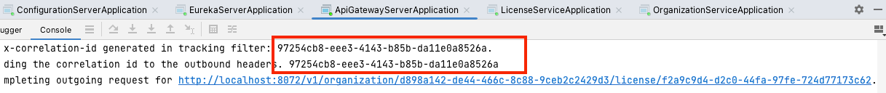
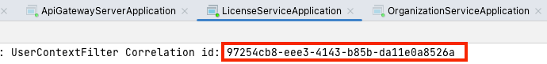
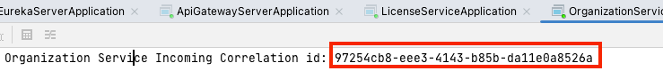

# 9. 마이크로서비스 보안
- 마이크로서비스 아키텍처를 갖게 되면서 `보안 취약점`을 **막는 작업은 중요**해진다.
- 마이크로서비스 아키텍처 보안 계층
  - `애플리케이션 계층`
    - 작업의 수행 권한이 있는지 확인
  - `인프라스트럭처`
    - 서비스를 항상 실행하고 패치하고 최신화
  - `네트워크 계층`
    - 서비스가 명확히 정의된 포트를 통해 인가된 소수의 서버에만 접근

> 공개된 취약점을 찾아내는 **OWASP**

- 스프링 기반의 서비스 보안
  - **스프링 클라우드 시큐리티**
  - **키클록**(ID 및 액세스 관리)

## 9.1 OAuth2소개
- 사용자는 `ID 제공자` 라고 하는 `제삼자 인증 서비스`로 **자신을 인증**
- 사용자는 인증에 성공하면 모든 요청과 함께 전달할 토큰을 제공받고 인증 서비스에 이 **토큰의 유효성을 확인**
- 요청을 처리하는 모든 서비스에 자격 증명을 제시하지 않고도 **각 서비스에서 사용자를 인증**
- OAuth2 명세에는 네 가지 그랜트 타입
  - 패스워드
  - 클라이언트 자격 증명
  - 인가 코드
  - 암시적
- OAuth2의 진정한 강점
  - 애플리케이션 개발자가 제삼자 ID 제공자와 쉽게 통합
  - 자격증명을 제삼자 서비스에 계속 전달하지 않고도 해당 서비스에서 사용자를 인증하고 인가

## 9.2 키클록 소개
- 키클록
  - `서비스`와 `애플리케이션`을 위한 **ID 및 액세스 관리용** 오픈 소스 솔루션
- **키클록의 주요 특징**
  - 인증을 중앙 집중화, `SSO 인증`을 가능하게 한다.
  - 보안 측면에 대해 걱정하기보다는 비즈니스 기능에 집중
  - 2단계 인증 가능
  - LDAP와 호환
  - 애플리케이션과 서버를 쉽게 보호할 수 있는 여러 어댑터를 제공
  - 패스워드 정책을 재정의
## 9.3 작게 시작하기: 스프링과 키클록으로 한 개의 엔드포인트 보호
### 9.3.1 도커에 키클록 추가하기
### 9.3.2 키클록 설정
### 9.3.3 클라이언트 애플리케이션 등록
### 9.3.4 O-stock 사용자 구성
### 9.3.5 O-stock 사용자 인증

## 9.4 키클록으로 조직 서비스 보호하기
### 9.4.1 스프링 시큐리티와 키클록 JARs를 서비스에 추가
### 9.4.2 키클록 서버 접속을 위한 서비스 구성
### 9.4.3 서비스에 접근할 수 잇는 사용자 및 대상 정의
### 9.4.4 액세스 토큰 전파
### 9.4.5 JWT의 사용자 정의 필드 파싱

## 9.5 마이크로서비스 보안을 마치며
## 9.6 요약

[게이트웨이 -> 라이센스 -> 조직]
             
             
               
## 8.8 요약
